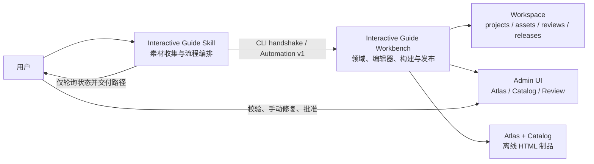
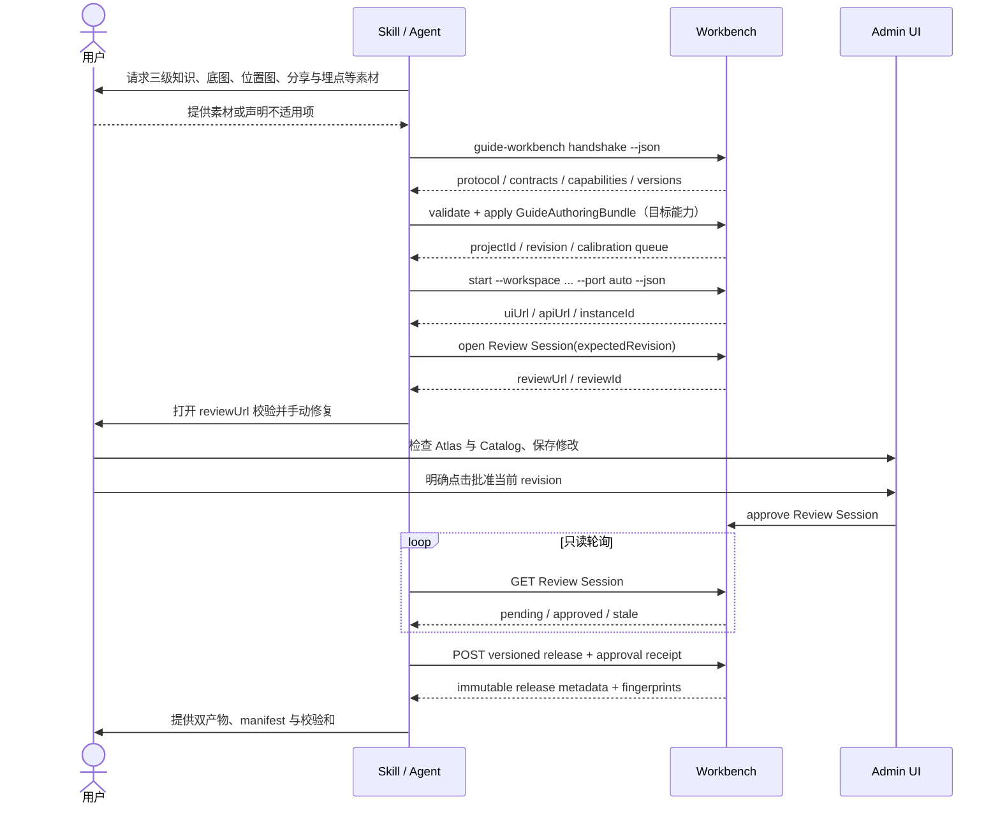

# Workbench 与 Skill 双版本离线编排架构

## 1. 文档定位

本文定义 Interactive Guide 面向离线制作场景的目标架构，以及当前实现与目标之间的边界。它取代“Skill 复制项目管线、运行时和模板”的旧方案。

核心结论：

- Workbench 是唯一的领域实现与状态所有者，负责项目、资产、校验、人工修复、预览和双产品发布。
- Skill 是薄编排层，负责素材收集、能力协商、调用稳定协议、等待用户确认和交付结果。
- 两者独立发布、独立升级，通过版本化 Automation Protocol 和能力握手协作。
- 离线安装包可以同时携带两个独立制品，但 Skill 不复制 Workbench 的 schema、编译器、运行时或业务规则。

本文描述的完整离线工作流尚未全部实现。当前已具备 Workbench CLI、能力握手、Review Session、人工批准门禁、资产闭包指纹和版本化发布入口；稳定 authoring contract、完整离线发行包与最终 ZIP 交付仍是下一阶段工作。

## 2. 架构原则

### 2.1 单一实现源

以下能力只能存在于 Workbench：

- GuideProject 迁移、规范化和校验；
- Atlas / Catalog 编译器和运行时；
- 资产注册、坐标编辑和引用闭包；
- revision 乐观锁；
- 草稿预览、人工校验和原子发布；
- release manifest、产物目录和完整性校验。

Skill 不得内置上述逻辑的副本，也不得直接编辑 `project.json`、`reviews/` 或 `releases/`。否则两个版本会在演进后产生不可检测的语义分叉。

### 2.2 协议兼容优先于程序版本

Skill 不能根据 Workbench SemVer 猜测兼容性。启动前必须执行握手，并同时检查：

1. Automation Protocol 主版本；
2. 所需 authoring contract 版本；
3. 所需 capability 集合；
4. 项目 schema 的可读、可写版本。

Workbench SemVer 用于诊断、审计和批准快照绑定。真正的调用兼容性由协议与契约版本决定。

### 2.3 失败关闭

遇到以下任一情况，Skill 必须停止自动写入并向用户说明缺口：

- Workbench 不存在或无法启动；
- 协议主版本不兼容；
- `authoringContracts` 中没有 Skill 所需契约；
- 必需 capability 缺失；
- 素材缺失或双语必填内容不完整；
- revision 冲突、Review 失效或资产完整性失败；
- 用户尚未在 Workbench 中完成批准。

不得降级为直接改 JSON、复制模板、写占位内容或调用未版本化内部接口。

## 3. 组件与所有权



| 组件 | 拥有的状态 | 允许的行为 | 禁止的行为 |
|---|---|---|---|
| Skill | 本次会话的素材清单、用户要求、调用日志 | 提问、校验输入、调用版本化 API、轮询、展示结果 | 复制领域规则、直接改 Workbench 文件、代替用户批准 |
| Workbench CLI / Server | workspace lock、项目、资产、Review、Release | 迁移、写入、校验、启动 UI、构建和发布 | 生成用户未提供的业务内容或占位数据 |
| Admin UI | 编辑器临时状态 | 人工校验、手动修复、明确批准 | 绕过 revision、资产或发布门禁 |
| Release | 不可变 Atlas / Catalog 目录与 manifest | 被读取、复制和交付 | 原地覆盖同一业务版本 |

## 4. 双版本发布模型

### 4.1 独立制品

需要维护两个发布序列：

| 制品 | 示例版本 | 兼容声明 | 升级节奏 |
|---|---|---|---|
| `interactive-guide-workbench` | `0.3.0` | 支持的 Automation Protocol、authoring contracts、project schemas、capabilities | 随编辑器、领域模型和运行时迭代 |
| `interactive-guide-skill` | `1.x` | 所需协议范围、契约范围和 capability 集合 | 随编排体验、素材收集和错误处理迭代 |

Skill manifest 建议声明：

```json
{
  "skillVersion": "1.0.0",
  "requires": {
    "automationProtocol": "1.x",
    "authoringContracts": ["guide-authoring-bundle@1.x"],
    "capabilities": [
      "revision-bound-review-approval",
      "approval-gated-release",
      "versioned-release-api"
    ]
  }
}
```

这里的 authoring contract 名称是目标设计，当前 Workbench 仍返回 `authoringContracts: []`。在契约真正落地前，正式 Skill 必须因此停止自动创建或修改项目。

### 4.2 兼容规则

- Automation Protocol 只在破坏性变更时升级主版本，并使用新的 `/api/automation/vN/` 路径。
- 同一协议主版本内只能追加可选字段、操作或 capability，不能改变已有字段语义。
- Authoring contract 独立版本化；新增可选字段升次版本，shape 或语义破坏升主版本。
- Skill 只调用 `/api/automation/vN/`，不得调用 Workbench 为 Admin 保留的未版本化写接口。
- Workbench 可继续保留旧入口给内部客户端迁移，但不能把它们写入 Skill。
- 每次人工批准绑定当时的 Workbench 精确版本；Workbench 升级后旧批准失效，需要重新校验。

### 4.3 离线发行包

为了满足“安装后无网络制作”，发行层提供一个可校验的 offline release kit：

```text
interactive-guide-offline-kit/
├─ skill/
│  └─ interactive-guide-skill-<version>/
├─ workbench/
│  └─ interactive-guide-workbench-<version>.tgz
├─ compatibility.json
├─ SHA256SUMS
└─ install.ps1 / install.sh
```

同包交付不等于代码耦合：安装器把 Workbench 注册为独立可执行程序，Skill 仅保存发现方式和兼容范围。以后可以只替换 Workbench 包；握手通过则无需更新 Skill。若升级产生协议主版本变化，则并行保留旧 Workbench 或升级 Skill，不做静默降级。

Workbench 离线包必须包含预编译 Admin、服务端和 Atlas / Catalog 浏览器运行时，运行制作流程时不得再访问 npm registry、CDN 或远程模板。

## 5. Skill 包结构

建议的 Skill 结构如下：

```text
interactive-guide-offline/
├─ SKILL.md
├─ compatibility.json
├─ references/
│  ├─ intake-contract.md
│  ├─ workflow-and-approval.md
│  ├─ error-recovery.md
│  └─ workbench-protocol-map.md
└─ scripts/
   ├─ workbench-client.mjs
   └─ verify-input-bundle.mjs
```

各文件职责：

- `SKILL.md`：触发条件、阶段顺序、必须停顿的位置和禁止事项；保持短小。
- `compatibility.json`：机器可读的协议、authoring contract 和 capability 要求。
- `intake-contract.md`：用户素材清单、必填/可选规则和可接受格式。
- `workflow-and-approval.md`：状态机以及“Skill 只能轮询，不能批准”的规则。
- `error-recovery.md`：稳定错误码对应的恢复动作。
- `workbench-protocol-map.md`：当前支持的版本化操作，不复制请求 schema 的业务定义。
- `workbench-client.mjs`：统一发起握手、HTTP 请求和轮询，输出机器可读 JSON。
- `verify-input-bundle.mjs`：只验证文件存在性、校验和与 intake envelope，不验证 GuideProject 业务规则。

Skill 中不得包含：

- GuideProject Zod schema 副本；
- Atlas / Catalog 编译代码或 HTML 模板；
- runtime bundle；
- 项目默认值或虚构示例内容；
- 自动调用批准接口的脚本。

## 6. 素材收集契约

Agent 调用 Skill 后，第一阶段必须先向用户索取并盘点素材。建议一次给出清单，并将回答归类为“已提供、缺失、明确不适用”，减少来回追问。

### 6.1 基本必填素材

| 类别 | 内容 | 约束 |
|---|---|---|
| 项目标识 | 项目 ID、业务版本、默认语言、启用语言 | ID 与版本必须通过 Workbench 契约校验 |
| 三级知识 | 上游 / 中游 / 下游，以及每层分类和第三级条目知识文档 | 标题、描述、稳定对应关系明确；双语项目提供所有启用语言内容 |
| 底图 | Atlas panorama 原图 | 不含需要本地化的文字；原始文件，不接受外链替代 |
| Hotspot 位置图 | 分类热点的标注图或坐标表 | 能唯一映射 category；坐标最终由 Workbench 归一化到 `[0,1]` |
| Callout 位置图 | 第三级条目 callout 的标注图或坐标表 | 能唯一映射 item；说明锚点和标签位置 |
| Catalog 聚焦信息 | 每个第三级条目的 `focusRect` 标注或坐标 | 未提供时不能虚构默认位置 |
| 分享文案 | title、description、分享图引用 | 所有启用语言完整；图片不按语言拆分 |
| 埋点配置 | appKey、pageType、事件来源等发布所需信息 | 标识符保持跨语言稳定，事件携带 locale |

### 6.2 按需素材

- HTML Scene bundle、入口文件、语言能力声明及其 category / item 绑定；
- 转场视频、poster、路由和时长；
- Atlas / Catalog hintText 和视觉主题要求；
- Catalog 初始聚焦投放参数示例；
- 资料来源、版权和交付命名要求。

### 6.3 Agent 处理边界

- Agent 可以把用户材料结构化、建立 ID 映射和生成待校准队列。
- Agent 不得补写业务事实、英文译文、坐标、分享文案或埋点值作为占位。
- 位置图存在歧义时必须列出具体节点让用户确认，不能按视觉相似度静默猜测。
- 用户明确声明某项不适用时，仍由 Workbench 校验该功能是否真的可关闭。

## 7. 目标 authoring contract

完整离线编排需要新增由 Workbench 拥有的 `GuideAuthoringBundle v1`，并配套原子 apply 操作。它应表达“用户提供了什么”，而不是暴露 `project.json` 的内部存储 shape。

建议 envelope 至少包含：

- contract 版本与幂等键；
- 项目标识、目标业务版本和语言配置；
- 知识源及双语内容映射；
- 本地资产文件、SHA-256、媒体类型与语义角色；
- hotspot、callout、focusRect 的语义目标和归一化位置；
- Scene、分享、埋点与产品配置；
- 来源记录与未决校准项。

目标写入流程：

1. `validate`：只读校验 bundle，返回字段级问题和将发生的变更摘要；
2. `apply`：携带 expected revision 和幂等键，WorkBench 在临时区注册资产并原子提交项目；
3. `read-back`：返回 project ID、最新 revision、规范化结果和人工校准队列；
4. 后续针对性修改通过版本化 ChangeSet，而不是重新覆盖完整项目。

在 `authoringContracts` 非空并完成契约测试之前，当前 Skill 架构只允许握手、启动工作台和读取能力，不能把现有内部项目接口冒充稳定 authoring API。

## 8. 端到端运行时流程



### 8.1 阶段状态机

| 阶段 | Skill 动作 | 用户动作 | 完成条件 |
|---|---|---|---|
| Intake | 收集并验证基本素材 | 补齐或确认不适用 | 输入 bundle 可校验 |
| Author | 调用版本化 validate/apply | 回答歧义项 | Workbench 返回 revision |
| Calibrate | 启动 Workbench，展示 URL | 手动调整热点、callout、focusRect 与文案 | 所有修改已保存 |
| Review | 创建会话并只读轮询 | 检查两个产品并点击批准 | 状态为 `approved` |
| Release | 携带完整 approval receipt 调版本化发布 | 无 | 原子构建成功且指纹一致 |
| Deliver | 复制或打包不可变制品，展示校验和 | 接收并验收 | Atlas、Catalog 和 manifest 完整 |

任何修改都会提升 revision；已批准会话随后变为 `stale`。Skill 必须创建新的 Review Session，不能重用或修改旧批准。

## 9. 人工批准的信任边界

当前批准绑定五个值：

- review ID；
- project revision；
- Workbench version；
- canonical project SHA-256；
- 实际发布资产闭包 SHA-256。

Release 必须同时匹配这些值，并在构建前、构建后和最终 commit 前复查源快照；Atlas 与 Catalog staging 中的资产树也必须匹配批准指纹。Release manifest `1.1.0` 记录指纹及其算法标识。

但当前批准接口与 Review JSON 仍位于同一台本地机器，具备 workspace 写权限的 Agent 理论上可以直接调用批准接口或篡改记录。因此它目前是可靠的流程门禁，不是对抗恶意 Skill 的“人类存在证明”。

正式 Skill 必须遵守以下硬规则：

- 只创建和 GET Review Session；
- 永不调用 `/approve`；
- 永不读写 `reviews/`；
- 仅在 GET 返回 `approved` 后使用响应中的 receipt；
- 遇到 `stale` 时重新发起会话并再次请求用户确认。

若未来需要技术上强制人类手势，应将批准写入 Workbench 独占状态，并使用 UI-only nonce、签名 receipt 或独立权限通道；不能只依赖 Skill 指令。

## 10. 当前 Automation v1 基线

| 操作 | 路径 | 调用者 | 状态 |
|---|---|---|---|
| 能力握手 | `GET /api/automation/v1/capabilities` | Skill | 已实现 |
| 创建 Review | `POST /api/automation/v1/projects/:id/review-sessions` | Skill | 已实现 |
| 读取 Review | `GET /api/automation/v1/review-sessions/:reviewId` | Skill / UI | 已实现 |
| 批准 Review | `POST /api/automation/v1/review-sessions/:reviewId/approve` | 仅 Workbench UI | 已实现，尚未技术隔离调用者 |
| 原子发布 | `POST /api/automation/v1/projects/:id/releases` | Skill | 已实现 |
| Authoring validate/apply | 待定义 | Skill | 未实现；`authoringContracts: []` |
| 制品 ZIP 与校验和交付 | 待定义 | Skill | 未实现 |

当前 Workbench 基线：

- Workbench `0.3.0`；
- Automation Protocol `1.0`；
- Review Session schema `1.0.0`；
- Release manifest 新版 `1.1.0`，旧 `1.0.0` 仍可读；
- 双产品、双语、Catalog `focus` 参数与原子不可变发布继续由 Workbench 实现。

## 11. 错误恢复语义

Skill 应按稳定错误码处理，不解析自然语言：

| 错误类别 | 恢复动作 |
|---|---|
| 协议 / capability 不兼容 | 停止，提示安装兼容 Workbench 或 Skill |
| `REVISION_CONFLICT` | 重新读取项目与 revision，展示差异后重试变更 |
| `REVIEW_NOT_RELEASE_READY` | 引导用户修复返回的字段级问题，不创建假值 |
| `ASSET_INTEGRITY_FAILED` | 显示具体 asset ID，要求重新注册或恢复文件 |
| `APPROVAL_STALE` | 创建新 Review Session，重新人工确认 |
| `APPROVAL_RECEIPT_MISMATCH` | 丢弃本地 receipt，重新 GET 会话；不得拼装字段 |
| `RELEASE_EXISTS` | 让用户提升业务版本或使用已存在不可变制品 |
| `WORKSPACE_IN_USE` | 连接现有受信实例，或在用户确认后选择另一 workspace |

## 12. 升级与回归策略

### 12.1 Workbench 升级

每个 Workbench 发布必须：

- 保持已声明 Automation v1 行为，或升级协议主版本；
- 提供 capabilities 契约快照测试；
- 用支持矩阵中的 Skill 版本执行离线端到端回归；
- 验证旧 release 可读、同版本不可覆盖；
- 验证 Admin 修改后批准自动失效；
- 验证批准后项目或资产字节变化会阻止发布。

### 12.2 Skill 升级

每个 Skill 发布必须：

- 对最低和最高支持 Workbench 执行握手测试；
- 在无 authoring contract、缺素材、revision 冲突、Review stale 时失败关闭；
- 证明不会调用 approve 或未版本化写接口；
- 不包含 Workbench schema、runtime 或模板副本；
- 在断网环境完成素材导入到双产物交付。

### 12.3 兼容矩阵

发行仓库维护机器可读矩阵，不把“最新版”作为兼容策略：

| Skill | Automation | Authoring contract | Workbench | 结果 |
|---|---|---|---|---|
| 目标 `1.x` | `1.x` | `guide-authoring-bundle@1.x` | 满足 capability 的任意版本 | 支持 |
| 目标 `1.x` | `1.x` | 缺失 | 当前 `0.3.0` | 只允许握手、启动与人工操作；禁止自动 authoring |
| `1.x` | `2.x` only | 任意 | 未来主版本 | 拒绝并要求升级 Skill |

## 13. 后续实施顺序

1. 冻结并实现 `GuideAuthoringBundle v1`、ChangeSet v1、validate/apply 和幂等语义。
2. 把浏览器运行时和 Admin 预编译进 Workbench 发布包，完成断网启动验证。
3. 增加不可变 release ZIP、SHA-256 清单和版本化下载操作。
4. 技术隔离 UI 批准与 Agent 调用权限，或签发可验证 receipt。
5. 使用 Skill Creator 创建薄 Skill，只串联上述契约，不搬运 Workbench 逻辑。
6. 构建 offline release kit，并对 Windows / macOS 的全断网流程做验收。

完整完成定义是：用户安装离线发行包后，Agent 能收集真实素材、通过稳定契约创建或修改项目、启动 Workbench 供人工修复、等待用户在 UI 中批准，最后交付同一不可变发布中的 Atlas 与 Catalog，而 Workbench 与 Skill 任一方的兼容升级都无需复制或同步另一方的实现代码。
