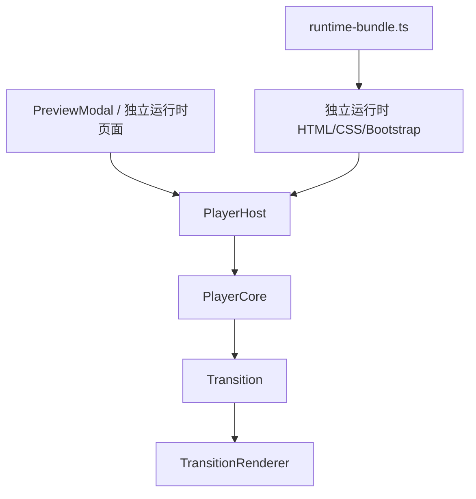

# 运行时渲染架构与扩展设计

## 1. 文档目的

- 说明预览弹窗、独立运行时与渲染核心之间的职责边界。
- 解释为什么 `runtime-bundle.ts` 仍然需要保留。
- 沉淀转场渲染中的关键不变量，避免再次出现“底层原始节点泄露”的问题。
- 为未来扩展转场、特殊节点、特殊边提供统一设计入口。

## 2. 当前渲染分层

当前运行时渲染采用三层结构：



### 2.1 视图层

- 管理端预览由 `src/admin/src/components/PreviewModal.tsx` 承载。
- 独立运行时页面由 `src/server/services/runtime-bundle.ts` 生成 `index.html / styles.css / app.js`。
- 这两处都不应该直接实现转场动画逻辑。
- 它们只负责：
  - 准备容器 DOM
  - 绑定用户交互和页面级通信
  - 实例化 `PlayerHost`
  - 监听运行时状态并刷新界面

### 2.2 宿主协调层

- 宿主协调层统一收敛到 `src/runtime/player-core/player-host.ts`。
- `PlayerHost` 负责：
  - 挂接 `nodeImage / nodeIframe / video / hotspots` 等宿主 DOM
  - 响应 `PlayerCore` 的 `stateChange` 并完成宿主渲染提交
  - 管理 `fitHeight / fitWidth` 图片拖拽与热点 viewport 同步
  - 处理宿主确认时序 `confirmHostVisualCommitIfReady()`
  - 提供对外导航入口：`navigateByEdge()`、`navigateToNode()`、`handleBack()`
- 预览弹窗与独立运行时都应复用这层，而不是各自维护一套宿主 glue code。

### 2.3 渲染核心层

- 渲染核心统一收敛到 `src/runtime/player-core/player-core.ts`。
- `PlayerCore` 负责：
  - 管理当前节点、历史栈、转场中状态
  - 处理热点点击与返回导航
  - 协调视频转场与内置转场
  - 管理基础节点图、视频层、临时转场容器
  - 发出 `stateChange / transitionStart / transitionEnd / error` 事件

### 2.4 动画实现层

- `src/runtime/transitions/` 提供内置转场抽象：
  - `Transition`
  - `TransitionRenderer`
  - `createTransition()`
- 每个具体 renderer 只负责动画渲染，不负责节点切换决策。

## 3. 为什么 `runtime-bundle.ts` 仍然需要保留

`runtime-bundle.ts` 不是旧的转场实现残留，而是独立运行时包生成器，职责仍然成立。

它当前承担的工作包括：

- 从 `publish/` 目录复制节点图与边视频到 `data/runtime-bundles/`
- 重写 `manifest` 中的资源地址为相对路径
- 生成独立运行时所需的 `index.html / styles.css / app.js`
- 注入已构建好的 `player-host` IIFE 产物
- 在运行时页面中桥接 iframe 场景所需的 `postMessage` 协议

因此：

- 应该保留 `runtime-bundle.ts`
- 不应该在 `runtime-bundle.ts` 中重新实现转场逻辑
- 应该让它只负责“打包与页面装配”

当前正确关系是：

- `PlayerCore` 是运行时行为内核
- `runtime-bundle.ts` 是独立运行时分发器

## 4. 渲染链路

### 4.1 预览模式

1. `PreviewModal` 加载 `manifest`
2. 创建 `PlayerHost`
3. 将 `stage / container / nodeImage / nodeIframe / video / hotspots` 传给 `PlayerHost`
4. 用户点击热点
5. `PlayerHost` 将交互请求交给 `PlayerCore`
6. 执行：
   - 直接切换
   - 视频转场
   - 内置转场
7. `PlayerHost` 刷新宿主 DOM，宿主 UI 同步标题、热点和返回态

### 4.2 独立运行时模式

1. `runtime-bundle.ts` 生成静态包
2. `app.js` 读取 `manifest.json`
3. 页面实例化 `PlayerHost`
4. `PlayerHost` 内部驱动 `PlayerCore`
5. 后续交互与预览模式复用同一套宿主和内核行为

### 4.3 iframe 嵌入模式

1. 父页面以 `iframe` 方式加载 runtime bundle 的 `index.html`
2. runtime 页面初始化完成后，通过 `postMessage` 向父页面发送 `interactive-guide:ready`
3. 父页面通过 `postMessage` 发送 `interactive-guide:command`
4. runtime bootstrap 将消息转发给 `PlayerHost.navigateByEdge()` / `navigateToNode()` / `handleBack()`
5. `PlayerHost` 继续走原有 `PlayerCore` 导航链路，保留视频转场和内置转场
6. runtime 完成命令处理后，通过 `interactive-guide:response` 回传执行结果

## 5. 必须遵守的不变量

以下规则必须长期成立，否则很容易再次出现转场错层、残影或节点泄露。

### 5.1 基础节点图唯一

- 基础节点图只有一张，即 `nodeImage`
- 它代表“当前稳定节点”
- 它不参与内置转场动画本身

### 5.2 转场层独占

- 内置转场期间，动画内容必须全部位于临时转场容器中
- 只有 renderer 可以把真正参与动画的元素插入临时容器
- `PlayerCore` 不得把 `fromEl / toEl` 直接挂进容器后再让 renderer 克隆一遍

这条规则是本次回归 bug 的根因：

- 如果 `PlayerCore` 先插入一层静态 `A`
- renderer 再插入一层动画 `A/B`
- 旋转、透视、透明区域出现时就会露出底下的原始 `A`

### 5.3 转场期间隐藏基础节点图

- 视频转场时必须隐藏基础节点图
- 内置转场时也必须隐藏基础节点图
- 转场结束后才恢复显示目标节点作为新的稳定态

### 5.4 状态恢复必须走统一出口

- 成功结束时通过 `switchNode()`
- 失败或中断时也必须恢复：
  - `transitioning = false`
  - `nodeImage` 可见
  - 临时容器清理完成
  - 视频状态清理完成
  - UI 收到 `stateChange`

### 5.5 状态切换顺序必须与 UI 刷新顺序一致

- `PlayerCore` 不能在宿主层完成 UI 刷新前，提前把旧节点的基础图重新显示出来。
- 对视频转场尤其如此：
  - 视频结束时，先更新内部状态到目标节点
  - 再通过 `stateChange` 触发宿主层刷新
  - 宿主层刷新后，显示的应当直接是目标节点 `B`
- 禁止出现这种顺序：
  - 先恢复旧节点 `A` 的基础图可见
  - 再触发 UI 刷新切到 `B`
- 否则用户会看到“视频播完后先闪一下 A，再切到 B”。

### 5.6 预览与独立运行时共享同一宿主 + 内核

- 任何页面级渲染和交互逻辑都优先放入 `PlayerHost`
- 导航状态机与转场调度优先放入 `PlayerCore`
- `PreviewModal` 和 `runtime-bundle.ts` 只做页面装配与外部集成
- 禁止在两个宿主层分别维护两套转场逻辑或两套拖拽逻辑

### 5.7 对外导航入口不能绕过边导航

- 外部调用如果要保留视频转场和内置转场，必须优先走“边导航”语义。
- 禁止把 `PlayerCore.switchNode()` 直接暴露给 iframe 外部。
- 正确做法是：
  - 已知边 ID 时，调用 `navigateByEdge(edgeId)`
  - 只知道节点 ID 时，调用 `navigateToNode(nodeId)`，并在当前节点存在直连边时自动退化为边导航
- 只有在不存在直连边时，才允许回退为普通 `navigateTo(nodeId)`，此时不会播放转场。

## 6. 本次问题复盘

本次“原始 A 再次露出”的直接原因是：

- `PreviewModal` 从组件内本地转场逻辑重构为使用 `PlayerCore`
- 迁移时把旧 bug 一起迁入了 `PlayerCore`
- 在 `playBuiltinTransition()` 中，`PlayerCore` 先把 `fromEl / toImg` 直接追加到临时容器
- renderer 又在同一容器中克隆并追加动画元素

结果表现为：

- `pan` 可能叠双层
- `flip` 容易在旋转时露出底部原始 `A`
- `zoom` 也可能出现多层内容干扰

修复原则是：

- `PlayerCore` 只构造临时容器和源元素引用
- renderer 负责实际 DOM 注入

### 6.1 视频转场回归问题补充

在完成 `PlayerCore` 抽离后，又出现了一次视频转场回归：

- 表现为：从节点 `A -> B` 播放过渡视频时，视频结束后会先短暂显示 `A`，然后才切到 `B`

直接原因是：

- `PlayerCore.switchNode()` 在发出 `stateChange` 之前，先把基础节点图恢复为可见
- 但此时宿主层还没有基于新的 `currentNodeId` 刷新到 `B`
- 所以短时间内显示的仍然是旧节点 `A`

修复原则是：

- `switchNode()` 只更新运行时状态并通知宿主层刷新
- 不提前强行显示旧节点的基础图
- 基础图是否可见，应由宿主层根据最新的 `currentNodeId + transitioning` 一次性渲染得出

这条规则说明：

- 渲染核心可以管理状态
- 但最终视觉呈现必须与宿主层的渲染提交保持同一步调
- 任何“先改 DOM、后发状态”的做法都可能导致旧节点闪现

## 7. 转场扩展设计

### 7.1 当前转场模型

当前边行为可分为：

- `none`
- `video`
- `builtin`

其中 `builtin` 进一步映射到：

- `pan`
- `flip`
- `zoom`

### 7.2 新增内置转场的方式

新增内置转场应只新增以下内容：

1. 在共享类型中声明配置结构
2. 在 `transition-interface.ts` 中扩展类型联合
3. 新增 `Transition` 实现
4. 新增 `TransitionRenderer` 实现
5. 在 `transition-factory.ts` 和 renderer factory 中注册
6. 在管理端表单中新增对应配置 UI

不应修改的层：

- `PreviewModal` 不应该感知具体转场类型细节
- `runtime-bundle.ts` 不应该写任何转场分支逻辑

### 7.3 特殊边扩展建议

未来如果边不仅是“跳转”，还可能是“弹窗说明边”“条件边”“延迟边”“脚本边”，建议引入统一动作层：

```ts
type EdgeAction =
  | { kind: 'navigate'; transition: ... }
  | { kind: 'open-overlay'; overlayType: ... }
  | { kind: 'run-script'; scriptId: string }
  | { kind: 'branch'; conditionId: string }
```

这样 `PlayerCore` 的职责会从“只处理跳转”扩展为“调度边动作”，而转场仍只是 `navigate` 的一个子步骤。

## 8. 特殊节点扩展设计

当前节点是“静态图片 + 热点”的单一模型。未来如果要支持特殊节点，建议抽象节点渲染器。

### 8.1 可预期的节点类型

- 普通信息图节点
- 视频节点
- HTML 互动节点
- 画布节点
- 临时说明节点

### 8.2 建议抽象

可以引入：

```ts
interface NodeRenderer {
  mount(container: HTMLElement, node: PublishNode): void
  update(node: PublishNode): void
  unmount(): void
}
```

后续由 `PlayerCore` 决定当前节点使用哪种 renderer。

这样做的收益：

- 节点展示能力和转场能力解耦
- 转场面对的是“当前节点可渲染表面”，而不是写死为 `img`

## 9. iframe 通信协议

### 9.1 协议目标

- 支持父页面以 `iframe` 嵌入独立运行时页面。
- 支持父页面在不直接访问 iframe 内部对象的情况下，安全触发导航。
- 保证所有外部导航仍复用 `PlayerHost -> PlayerCore` 链路，避免转场丢失。

### 9.2 父页面 -> runtime

父页面发送：

```ts
{
  source: 'interactive-guide-host'
  type: 'interactive-guide:command'
  requestId?: string
  action: 'navigateToNode' | 'navigateByEdge' | 'handleBack' | 'getState'
  payload?: Record<string, unknown>
}
```

其中：

- `navigateToNode` 需要 `payload.nodeId`
- `navigateByEdge` 需要 `payload.edgeId`
- `handleBack` 不需要参数
- `getState` 不需要参数

### 9.3 runtime -> 父页面

runtime 初始化完成后发送：

```ts
{
  source: 'interactive-guide-runtime'
  type: 'interactive-guide:ready'
  state: PlayerHostState | null
}
```

runtime 处理命令后发送：

```ts
{
  source: 'interactive-guide-runtime'
  type: 'interactive-guide:response'
  requestId: string | null
  action: string
  ok: boolean
  payload: unknown
}
```

### 9.4 `guide_1779344993154` 调用示例

该项目根节点与一层节点如下：

- `root`
- `rocket`
- `ground-station`
- `launch-detection`
- `rocket-fuel`
- `monitoring-and-operations`
- `satellite-communication`
- `rocket-testing`

从 `root` 出发的边如下：

- `edge-root-to-rocket`
- `edge-root-to-ground-station`
- `edge-root-to-launch-detection`
- `edge-root-to-rocket-fuel`
- `edge-root-to-monitoring`
- `edge-root-to-communication`
- `edge-root-to-testing`

推荐调用策略：

- 回到首页：发送 `navigateToNode(root)` 或在有返回栈时发送 `handleBack()`
- 从首页进入子节点：优先发送 `navigateByEdge(edgeId)`，保留视频转场或内置转场
- 在子节点间横跳：先返回 `root`，再按边进入目标节点

示例：

```js
iframe.contentWindow.postMessage({
  source: 'interactive-guide-host',
  type: 'interactive-guide:command',
  requestId: 'req-root',
  action: 'navigateToNode',
  payload: { nodeId: 'root' },
}, '*')

iframe.contentWindow.postMessage({
  source: 'interactive-guide-host',
  type: 'interactive-guide:command',
  requestId: 'req-rocket',
  action: 'navigateByEdge',
  payload: { edgeId: 'edge-root-to-rocket' },
}, '*')

iframe.contentWindow.postMessage({
  source: 'interactive-guide-host',
  type: 'interactive-guide:command',
  requestId: 'req-ground',
  action: 'navigateByEdge',
  payload: { edgeId: 'edge-root-to-ground-station' },
}, '*')
```

### 9.5 HTML 节点内嵌通信目标

除了“父页面嵌入独立运行时页面”的 iframe 通信之外，运行时内部还存在另一层 iframe 通信场景：

- `PlayerHost` 宿主层负责承载 HTML 节点 iframe
- HTML 节点页面需要与运行时宿主通信
- `PlayerCore` 仍然只负责导航与转场，不直接监听 `window.message`

当前 HTML 节点协议先支持两件事：

1. HTML 节点请求返回上一节点
2. 运行时切换到 HTML 节点后，通知节点执行初始化

对应实现落点：

- 协议与 bridge：`src/runtime/player-core/html-node-bridge.ts`
- 宿主接入：`src/runtime/player-core/player-host.ts`

链路关系为：

```text
HTML iframe
  -> HtmlNodeBridge
  -> PlayerHost
  -> PlayerCore
```

这样可以保证：

- 协议扩展不污染 `PlayerCore`
- 预览模式与独立运行时模式继续共用同一个 `PlayerHost`
- HTML 节点能力扩展时只改 bridge 和宿主层

### 9.6 HTML 节点协议 envelope

正式消息统一使用：

```ts
interface HtmlNodeBridgeEnvelope<TType extends string = string, TPayload = unknown> {
  channel: 'interactive-guide:html-node-bridge'
  version: '1.0.0'
  source: 'interactive-guide-host' | 'interactive-guide-html-node'
  kind: 'event' | 'request' | 'response'
  type: TType
  requestId?: string
  payload?: TPayload
}
```

约束：

- `channel` 用于与其他 `postMessage` 流量隔离
- `version` 用于协议演进
- `kind` 统一抽象为 `event / request / response`
- `type` 使用命名空间风格，便于后续新增命令

当前 bridge 会校验：

- `channel === 'interactive-guide:html-node-bridge'`
- `version === '1.0.0'`
- `source` 必须匹配约定值
- `event.source` 必须等于当前激活 HTML iframe 的 `contentWindow`

因此页面上其他脚本或非当前节点 iframe 的消息不会误触发运行时行为。

### 9.7 当前已实现消息

宿主 -> HTML 节点：

```ts
type: 'host:node-init'
kind: 'event'
payload: {
  activationId: string
  sessionId: string
  node: {
    id: string
    title: string
    htmlUrl?: string
    imageUrl?: string
    contentType?: 'image' | 'html'
  }
  runtime: {
    currentNodeId: string
    historyDepth: number
    canGoBack: boolean
  }
}
```

说明：

- 在 HTML 节点真正成为“当前可交互节点”后发送
- 不是只在 iframe 首次 load 时发送
- 每次重新进入同一个 HTML 节点，都会得到新的 `activationId`
- 适合做动画重置、滚动复位、按钮状态刷新等初始化逻辑

宿主 -> HTML 节点退出事件：

```ts
type: 'host:node-exit'
kind: 'event'
payload: {
  activationId: string
  sessionId: string
  node: {
    id: string
    title: string
    htmlUrl?: string
    imageUrl?: string
    contentType?: 'image' | 'html'
  }
}
```

说明：

- 在当前 HTML 节点即将失活、切走或被宿主取消激活时发送
- 用于通知节点卸载本轮进入期间挂载的动态 DOM、停止局部动画或清理临时状态
- 建议 HTML 页面用 `activationId + node.id` 做接收方识别，避免误清理其他节点或历史会话

HTML 节点 -> 宿主：

```ts
type: 'html:request-back'
kind: 'request'
payload: {
  reason?: string
}
```

响应：

```ts
type: 'html:request-back'
kind: 'response'
payload: {
  ok: boolean
  payload:
    | {
        handled: boolean
        runtime: {
          currentNodeId: string
          historyDepth: number
          canGoBack: boolean
        }
      }
    | {
        message: string
      }
}
```

说明：

- `ok = true` 且 `handled = false` 表示当前没有上一节点可退
- `ok = false` 表示宿主处理请求时出现异常
- 实际返回行为仍走 `PlayerCore.handleBack()`，不会绕过历史栈和既有切换链路

兼容策略：

- 旧 HTML 节点仍可继续发送 `{ type: 'hotspot-click', edgeId }`
- bridge 只对当前激活 iframe 接受该旧消息
- 新页面建议逐步迁移到正式 envelope 协议

### 9.8 HTML 节点初始化时机

`host:node-init` 只有在以下条件同时满足时才发送：

1. 当前节点 `contentType === 'html'`
2. 对应 iframe 已加载完成
3. 当前不在转场遮挡阶段
4. 该 iframe 已被宿主判定为当前激活节点

这样做的原因：

- 避免 HTML 页面在不可见阶段提前执行尺寸计算
- 兼容 iframe 缓存复用，保证每次进入节点都能收到明确的初始化信号
- 保持宿主层视觉提交时序与节点初始化时序一致

`host:node-exit` 会在宿主取消当前 HTML 节点激活态时发送，典型场景包括：

1. 切换到图片节点
2. 切换到另一个 HTML 节点
3. 当前 HTML 节点进入转场遮挡阶段，宿主暂时取消其激活态

这样可以让 HTML 页面在宿主隐藏 iframe 之前，主动卸载本轮 build 出来的动态 DOM，减少再次进入时的闪烁。

### 9.9 HTML 节点接入示例

建议 HTML 页面自己封装一个轻量 helper：

```html
<script>
  const CHANNEL = 'interactive-guide:html-node-bridge'
  const VERSION = '1.0.0'
  const HTML_SOURCE = 'interactive-guide-html-node'

  function buildEnvelope(kind, type, payload, requestId) {
    return {
      channel: CHANNEL,
      version: VERSION,
      source: HTML_SOURCE,
      kind,
      type,
      requestId,
      payload,
    }
  }

  function createRequestId(prefix) {
    if (window.crypto && typeof window.crypto.randomUUID === 'function') {
      return `${prefix}-${window.crypto.randomUUID()}`
    }
    return `${prefix}-${Date.now()}-${Math.random().toString(16).slice(2)}`
  }
<\/script>
```

监听初始化事件：

```html
<script>
  window.addEventListener('message', (event) => {
    const data = event.data
    if (!data || data.channel !== 'interactive-guide:html-node-bridge') return
    if (data.version !== '1.0.0') return
    if (data.source !== 'interactive-guide-host') return
    if (data.kind !== 'event') return
    if (data.type === 'host:node-init') {
      initHtmlNode(data.payload)
      return
    }
    if (data.type === 'host:node-exit') {
      teardownHtmlNode(data.payload)
    }
  })

  function initHtmlNode(payload) {
    // 每次进入 HTML 节点都执行一次：
    // - 重置滚动位置
    // - 重启节点内动画
    // - 刷新返回按钮可用状态
    // - 拉起节点内局部数据初始化
  }

  function teardownHtmlNode(payload) {
    // 节点退出时执行一次：
    // - 卸载本轮挂载的动态 DOM
    // - 停止节点内动画/定时器
    // - 清理临时交互状态
  }
<\/script>
```

请求返回上一节点：

```html
<script>
  function requestBack(reason = 'html-ui-back-button') {
    const requestId = createRequestId('html-back')

    return new Promise((resolve, reject) => {
      const handleMessage = (event) => {
        const data = event.data
        if (!data || data.channel !== 'interactive-guide:html-node-bridge') return
        if (data.version !== '1.0.0') return
        if (data.source !== 'interactive-guide-host') return
        if (data.kind !== 'response') return
        if (data.type !== 'html:request-back') return
        if (data.requestId !== requestId) return

        window.removeEventListener('message', handleMessage)
        if (data.payload?.ok === false) {
          reject(new Error(data.payload?.payload?.message || '返回失败'))
          return
        }
        resolve(data.payload?.payload)
      }

      window.addEventListener('message', handleMessage)
      window.parent.postMessage(
        buildEnvelope('request', 'html:request-back', { reason }, requestId),
        '*',
      )
    })
  }
<\/script>
```

接入建议：

- 不要把初始化逻辑只放在 `DOMContentLoaded`
- 进入节点即重置的逻辑统一放进 `host:node-init`
- 退出节点即清理的逻辑统一放进 `host:node-exit`
- 自定义返回按钮统一调用 `html:request-back`
- 后续如需扩展 `navigateByEdge`、`getRuntimeState`、`html-ready` 等能力，应继续沿用同一 envelope

## 10. 宿主层职责约束

### 10.1 `PreviewModal`

只负责：

- 加载 manifest
- 实例化 `PlayerHost`
- 将节点标题、摘要、热点 UI 与引擎状态对齐

不负责：

- 直接计算转场逻辑
- 直接管理内置转场 DOM

### 10.2 `runtime-bundle.ts`

只负责：

- 静态包组装
- 运行时页面骨架
- 注入 `player-host` bundle
- 页面级交互 glue code
- iframe `postMessage` 协议桥接

不负责：

- 重写 `PlayerCore` 行为
- 手写 `pan / flip / zoom` 动画

## 11. 构建与发布约束

当前独立运行时依赖 `src/runtime/player-core/dist/player-host.js`。

因此：

- 修改 `src/runtime/player-core/player-host.ts` 或其依赖后，需要重新执行 `npm run build:player-host`
- `runtime-bundle.ts` 在打包时读取该产物
- 如果构建产物缺失，应直接报错并阻止打包

建议约束：

- 发布前将 `build:player-host` 纳入标准构建流程
- 不要依赖人工记忆来更新 dist 产物

## 12. 未来建议

### 12.1 短期建议

- 为 `PlayerHost + PlayerCore` 增加宿主侧回归测试
- 覆盖：
  - 转场期间基础节点图隐藏
  - 临时容器中没有多余静态 `from/to` 元素
  - 转场结束后容器被正确清理
  - iframe 命令不会绕过转场链路

### 12.2 中期建议

- 将节点渲染抽象为 `NodeRenderer`
- 将边行为抽象为 `EdgeAction`
- 保持 `PlayerCore` 只做调度，不承载具体视觉细节
- 为 iframe 通信增加 targetOrigin 白名单和状态变更事件上报

### 12.3 长期建议

- 为预览与独立运行时建立共享的测试样例 manifest
- 建立“同一份 manifest 在两种宿主环境下视觉一致”的验证流程

## 13. 结论

当前推荐的稳定架构是：

- `PreviewModal` = 管理端预览页面壳
- `PlayerHost` = 唯一宿主协调层
- `PlayerCore` = 唯一运行时行为内核
- `transitions/*` = 转场动画实现层
- `runtime-bundle.ts` = 独立运行时包生成器

必须避免的情况是：

- 在宿主层重复实现转场
- 直接把 `switchNode()` 暴露给 iframe 外部
- 在容器中同时保留基础节点图和额外静态转场层
- 预览与独立运行时各自维护不同逻辑

只要持续遵守“单一宿主层 + 单一内核 + 页面层只做装配 + 外部通信不绕过边导航”的原则，后续扩展转场、特殊节点、iframe 集成和特殊边时，复杂度仍然可控。
