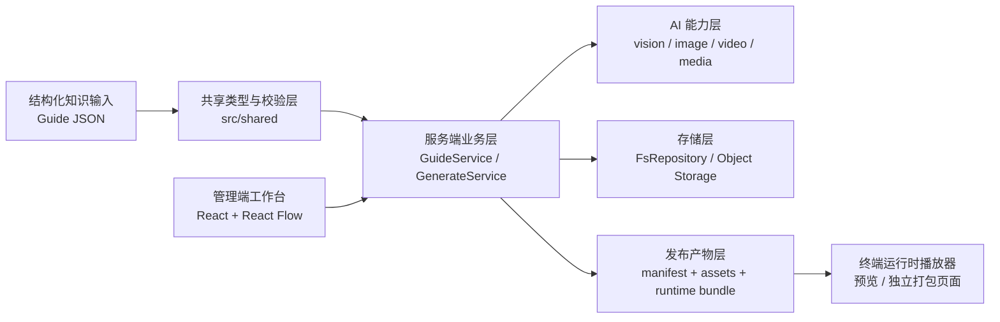
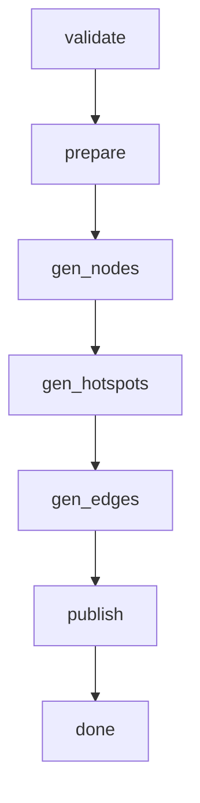

# Interactive Guide 项目技术架构与核心逻辑总览

## 1. 文档目的

- 本文档用于从全局角度说明 `Interactive Guide` 的技术架构、核心逻辑设计方案、关键数据流、应用场景与扩展方向。
- 与现有文档的关系是：
  - `后端详细设计方案.md` 更偏后端实现。
  - `管理端UI与操作流程设计.md` 更偏管理端交互。
  - `发布Manifest与运行时数据契约设计.md` 更偏运行时契约。
  - 本文档负责把这些内容串成一条完整业务链路。

## 2. 项目定位

`Interactive Guide` 是一个面向运营、教学或内容生产团队的预生成式交互导览系统。它的核心目标不是让终端用户在运行时临时生成内容，而是先把结构化知识编译为一套可运行、可发布、可打包的互动导览产物，再提供给终端用户进行探索。

项目围绕三个事实展开：

- 输入是结构化知识图谱，而不是自由文本会话。
- 资源生成发生在构建阶段，而不是用户点击阶段。
- 运行时播放器尽可能轻量，只消费 `manifest + 静态资源`。

这意味着项目本质上更接近“知识编译器 + 导览播放器”，而不是“在线多模型问答系统”。

## 3. 总体技术架构

### 3.1 分层结构



### 3.2 仓库结构

```text
src/
├── shared/        共享类型、校验器、工具函数
├── server/        Express 服务端、生成管线、AI 适配、存储层
├── admin/         React 管理端工作台
└── skills/        辅助技能与参考资料

data/
├── guides/        知识包源数据
├── generates/     构建中间产物与过程记录
├── publish/       发布清单与静态资源
└── runtime-bundles/ 独立运行时打包结果
```

### 3.3 技术栈

- 后端：`Express 5 + TypeScript + Zod + tsx`
- 前端：`React 19 + Vite + Chakra UI + React Flow`
- 数据持久化：`JSON 文件 + 内存 Map 缓存`
- AI 能力：
  - 视觉理解与规划：Vision/LLM 模型
  - 节点图片生成：DashScope 或 OpenAI 兼容接口
  - 边转场视频生成：DashScope / MiniMax / WanXiang 多提供方路由
- 对象存储：`S3 Compatible` 接口，用于公开节点图资源给视频模型使用

## 4. 核心设计思想

### 4.1 预生成优先

- 节点图片、热点坐标、边转场视频都在构建阶段生成。
- 运行时不做复杂推理，不依赖大模型在线编排。
- 用户最终看到的是已经固化好的知识导览体验。

这样做的收益是：

- 运行时更稳定，首屏和点击体验更可控。
- 生成成本集中在后台，便于缓存、重试和人工干预。
- 产物可以预览、发布、导出和独立部署。

### 4.2 Node + Edge + Hotspot 模型

- `Node` 表示一个可展示的信息页面。
- `Edge` 表示从一个页面到另一个页面的跳转关系。
- `Hotspot` 表示用户在当前页面上的可点击入口，也是 `Edge` 的视觉锚点。

这种设计统一了三件事：

- 知识结构关系
- 页面间导航逻辑
- 视觉交互入口

### 4.3 强契约驱动

项目把共享类型集中在 `src/shared/types.ts` 中，服务端、管理端和运行时共用一套类型模型。核心契约包括：

- 知识输入契约：`KnowledgePackage / KnowledgeNode / KnowledgeEdge`
- 构建过程契约：`PackageBuildRecord / NodeBuildRecord / EdgeBuildRecord`
- 发布契约：`PublishManifest`
- 运行时契约：`RuntimeBundlePayload / PreviewSessionPayload`

这使得项目可以用“先定义数据契约，再驱动生成与渲染”的方式演进。

### 4.4 人工干预可插拔

虽然系统强调自动生成，但没有走“全自动黑盒”路线，而是保留了多个运营干预点：

- 修改知识包元信息和全局风格
- 编辑节点内容、摘要、视觉意图
- 编辑边关系与转场描述
- 重新推荐热点
- 手动拖拽校准热点
- 单节点重跑、单边重跑、整包重跑

这让系统更适合生产环境，而不是只适合演示。

## 5. 核心模块设计

### 5.1 共享层

`src/shared` 负责整个系统的基础协议。

- `types.ts` 定义节点、边、热点、构建记录、发布清单、运行时状态等类型。
- `validators.ts` 负责知识包和发布清单校验。
- `utils.ts` 提供时间、ID 等通用工具。
- `validate-package.ts` 用于离线校验输入包是否合法。

共享层的意义在于让“输入数据结构”“后台生成过程”“前端消费方式”保持一致。

### 5.2 服务端层

服务端由四类模块组成：

- 路由层：`routes/`
- 业务服务层：`services/`
- AI 能力层：`ai/`
- 存储层：`storage/`

入口文件 `src/server/index.ts` 完成依赖装配：

- 加载配置
- 初始化 `FsRepository`
- 注入 `GuideService` 和 `GenerateService`
- 注册路由和错误处理中间件
- 暴露静态产物目录

这使得业务逻辑与具体存储实现、模型实现保持解耦。

### 5.3 管理端层

管理端是一个围绕知识包工作流设计的运营工作台，主要由三页组成：

- 知识包总览页
- 单个知识包工作台
- 生成历史页

其中工作台页是核心，采用 `React Flow` 展示知识图结构，通过右侧详情抽屉编辑节点、边和包配置，并通过弹窗进行预览与热点校准。

### 5.4 存储层

当前版本采用 `FsRepository` 作为默认存储实现，其特点是：

- 以内存 `Map` 承接运行期数据读取
- 以 `data/` 目录中的 JSON 文件实现落盘
- 通过 `Repository` 接口隔离未来数据库或对象存储迁移

目录职责大致如下：

- `data/guides/`：知识包源数据
- `data/generates/`：每次生成的过程快照、日志、节点图、热点记录、边视频
- `data/publish/`：发布后的 `manifest` 与资源
- `data/runtime-bundles/`：导出的独立运行包

### 5.5 AI 能力层

AI 层不是直接暴露给前端，而是被 `GenerateService` 编排调用。

- `vision.ts`
  - 推荐热点坐标
  - 规划边转场视觉方案
- `image.ts`
  - 生成节点信息图图片
  - 支持缓存命中
- `video.ts`
  - 生成边转场视频
  - 统一封装多提供方任务提交、轮询、下载
- `video-provider.ts`
  - 将 DashScope、MiniMax、WanXiang 抽象成统一 Provider 接口
- `media.ts`
  - 把节点图片暴露成视频模型可访问的 HTTP URL
- `cache.ts`
  - 管理 planner、image、video 等结果缓存

## 6. 核心业务对象

### 6.1 知识包

知识包是系统的顶层业务实体，包含：

- 基础元数据：`id`、`title`、`version`
- 全局配置：`resolution`、`style`、`visualStyle`、`transitionStyle`
- 内容结构：`nodes[]`、`edges[]`

它既是运营的编辑对象，也是构建系统的输入对象。

### 6.2 节点

节点代表一个知识页面，核心字段包括：

- 内容表达：`title`、`summary`、`keyPoints`、`sourceText`、`keyContent`
- 视觉表达：`visualIntent`、`presentationIntent`、`topicType`
- 资源状态：`imageUrl`、`imageStatus`
- 交互入口：`hotspots`

节点的目标不是存储“纯文本正文”，而是描述“这一页该如何被解释和呈现”。

### 6.3 边

边代表节点之间的跳转关系，核心字段包括：

- 结构关系：`fromNodeId`、`toNodeId`
- 导航语义：`relationLabel`
- 转场控制：`transitionDescriptionMode`、`manualTransitionPrompt`
- 视频状态：`videoStatus`、`videoUrl`
- 规划结果：`transitionPlan`、`transitionStrategyMode`

边不仅定义导航，还定义“如何从 A 页视觉过渡到 B 页”。

### 6.4 发布清单

`PublishManifest` 是运行时最关键的消费契约，包含：

- 所有节点与边的扁平数组
- `nodeMap` 与 `edgeMap` 的索引结构
- 根节点 `rootNodeId`
- 页面资源 URL 和热点信息

运行时播放器只依赖它和静态资源即可工作，因此它是连接“构建后台”和“最终体验”的桥梁。

## 7. 核心逻辑设计方案

### 7.1 逻辑主线一：知识包管理

`GuideService` 负责知识包、节点、边、热点的 CRUD 和基本校验。

它解决的是“内容如何被维护”的问题，主要能力包括：

- 导入知识包
- 更新知识包配置
- 新增和删除节点
- 更新节点与热点
- 更新边
- 读取最新 manifest

设计原则是：

- 路由层尽量薄，只做请求转发和异常捕获
- 业务规则集中在 `GuideService`
- 存储细节通过 `Repository` 隔离

### 7.2 逻辑主线二：生成编排

`GenerateService` 是项目的核心编译器，负责把知识包转换为可运行产物。

其六阶段流水线如下：



每个阶段的职责如下：

1. `validate`
   - 校验知识包结构合法性
   - 生成 `validation-report.json`
2. `prepare`
   - 写入知识包快照
   - 初始化生成目录
3. `gen_nodes`
   - 按 BFS 顺序遍历节点
   - 为每个节点生成图片 Prompt
   - 调用图像模型生成节点图
4. `gen_hotspots`
   - 基于节点图调用视觉模型推荐热点
   - 保留人工热点作为兜底和最终可校正结果
5. `gen_edges`
   - 为每条边规划转场策略
   - 暴露首尾帧
   - 调用视频模型异步生成转场视频
6. `publish`
   - 拷贝节点图与边视频到发布目录
   - 构建 `manifest.json`

### 7.3 节点生成策略

节点图片生成不是直接把一段内容扔给模型，而是先进行结构化拼装。

`GenerateService.buildImagePrompt()` 会综合以下信息：

- 画布尺寸与横竖屏规则
- 全局视觉风格
- 节点主题类型
- 节点摘要与关键点
- 原始来源文本
- 视觉意图
- 热点提示信息

这样设计的目的，是让模型更倾向于生成“高信息密度的信息图”，而不是偏题的氛围插画。

### 7.4 热点设计策略

热点生成采用“视觉推荐 + 人工校正”的折中方案。

- 自动阶段：视觉模型根据节点图识别各目标区域，推荐 `normalizedX/Y`
- 保底阶段：如果推荐失败，则使用手工预设坐标
- 人工阶段：运营在工作台中拖拽调整，最后回写到知识包和 manifest

这套方案同时满足：

- 自动化效率
- 可运营修正
- 分辨率适配能力

### 7.5 边转场设计策略

边转场并不只是简单地生成一个视频，而是先做策略判定，再生成 Prompt。

系统目前支持三种策略模式：

- `element-bridge`
- `fallback-navigation`
- `manual-directed`

策略来源有两类：

- 自动模式：通过 `vision.planTransitionVisuals()` 分析首尾帧结构连续性
- 手动模式：运营直接提供人工转场描述，跳过自动规划

随后系统再基于以下信息拼装最终转场 Prompt：

- 起始节点与目标节点摘要
- 热点的空间位置
- 页面风格和画布比例
- 转场模式与阶段说明
- 避免事项

这保证了视频模型输出的转场更接近“空间导航”，而不是泛化的特效动画。

### 7.6 运行时设计策略

当前运行时有两种形态：

- 服务端预览形态：通过 `/api/media` 和 manifest 直接预览发布结果
- 独立打包形态：通过 `packageGuide()` 输出 `index.html + app.js + styles.css + manifest.json + assets`

运行时逻辑非常轻量，核心流程为：

```text
加载 manifest
-> 定位 root 节点
-> 渲染当前节点图片
-> 叠加热点按钮
-> 点击热点后查找 edge
-> 如果存在视频则播放转场
-> 切换到目标节点
-> 更新面包屑与返回栈
```

这里的关键设计是：运行时不关心 AI 如何生成资源，只关心 manifest 中定义好的导航结构和资源地址。

## 8. 关键数据流

### 8.1 内容流


### 8.2 状态流

项目把状态信息分散但统一地写回多个对象：

- 包级：`PackageBuildRecord`
- 节点级：`NodeBuildRecord`
- 边级：`EdgeBuildRecord`
- 页面级展示状态：`imageStatus` / `videoStatus`
- 运行时级：`RuntimeState`

这使得管理端可以同时从“任务视角”和“图结构视角”观察系统状态。

### 8.3 文件流

一次完整生成后，典型输出路径如下：

```text
data/guides/{guideId}/current/guide.json
data/generates/{buildId}/generate.json
data/generates/{buildId}/nodes/{nodeId}/image.png
data/generates/{buildId}/edges/{edgeId}/transition.mp4
data/publish/{guideId}/{version}/manifest.json
data/publish/{guideId}/{version}/assets/nodes/*.png
data/publish/{guideId}/{version}/assets/edges/*.mp4
data/runtime-bundles/{bundleId}/
```

## 9. 管理端交互方案

### 9.1 知识包总览

承担知识包级入口能力：

- 导入 JSON
- 新建空白知识包
- 查看列表摘要
- 发起整包生成
- 导出知识包
- 删除知识包

### 9.2 工作台

工作台是运营的核心作业界面，集成了：

- 中央知识图画布
- 左侧节点/边快速导航与失败筛选
- 右侧详情抽屉
- 顶部生成、预览、打包操作
- 热点校准弹窗

这意味着“知识编辑、资源重跑、状态查看、预览验证”都在一个上下文中完成。

### 9.3 生成历史

生成历史页从任务维度展示：

- 每次构建的状态
- 当前阶段
- 节点/边成功数
- 构建日志
- 执行耗时

它是工作台之外的补充诊断视角。

## 10. 应用场景

### 10.1 教育与课程导览

适用于把复杂知识拆成可探索节点，例如：

- 宏观经济学知识导览
- 科普课程知识图谱
- 历史事件多分支讲解

价值在于把“线性课件”改造成“结构化探索式学习”。

### 10.2 产业研究与行业图谱

适用于产业链、技术路线、政策结构、公司关系等内容的互动表达，例如：

- 商业航天产业链导览
- 半导体技术链路拆解
- 政策工具与传导机制图谱

价值在于把原本难以阅读的大量信息，转成可逐层进入的可视化导览。

### 10.3 展示型内容产品

适用于品牌展厅、展会导览、专题内容页等需要“轻交互 + 强视觉”的场景，例如：

- 线上专题展览
- 博物馆数字导览
- 企业能力展示地图

价值在于既保留视觉表现，又能通过热点和转场形成叙事路径。

### 10.4 面向运营的可复用内容生产

适用于内容团队批量生产主题化导览包，例如：

- 不同学科的课程包
- 不同行业的研究报告导览版
- 不同地区或主题的政策图解包

系统的包级输入和版本结构使它天然适合复用与批量管理。

## 11. 当前优势与边界

### 11.1 优势

- 架构清晰，构建期与运行时职责边界明确
- 数据契约完整，前后端共享类型
- 支持多视频提供方路由，具备一定供应商切换能力
- 支持缓存、单项重跑、人工校准，适合真实运营场景
- 发布形态完整，可预览也可导出独立运行包

### 11.2 当前边界

- 默认存储仍是文件系统，适合单机或轻量场景
- 构建任务目前是进程内异步执行，不是独立任务队列
- 并发控制、权限体系、协作审计能力尚未完善
- 运行时播放器仍偏轻量，暂未引入更复杂的埋点与分析系统
- 目前更适合“中小规模、高价值内容包”，而非超大规模实时生产平台

## 12. 演进方向建议

### 12.1 基础设施演进

- 从 `FsRepository` 迁移到数据库 + 对象存储组合
- 将生成任务改造成独立任务队列或 Worker 架构
- 增加任务恢复、重试、限流和并发调度能力

### 12.2 内容能力演进

- 增强知识包输入 Schema
- 增加更强的节点内容拆解与知识增强
- 引入模板化页面布局与风格预设库

### 12.3 运营能力演进

- 增加版本对比、回滚、审核流
- 增加多人协作与权限控制
- 增加构建成本、成功率、使用效果等分析指标

## 13. 总结

`Interactive Guide` 的核心竞争力，不是单个模型能力，而是它把“结构化知识、AI 生成、人工校准、发布运行”组织成了一条可运营、可维护、可交付的生产链路。

从技术架构上看，它已经具备以下完整闭环：

- 以共享类型为基础的输入契约
- 以 `GuideService` 为核心的内容管理
- 以 `GenerateService` 为核心的六阶段编译管线
- 以 `PublishManifest` 为核心的运行时数据契约
- 以管理端工作台为核心的运营操作界面

如果后续继续补强任务基础设施、存储能力和协作能力，它可以从一个单项目导览系统，逐步演进为一个通用的“结构化知识导览生产平台”。
