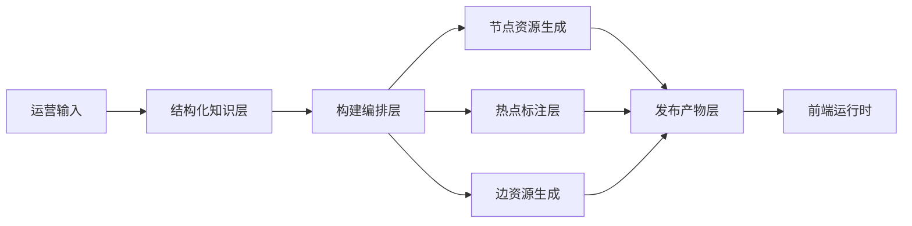

# Interactive Guide 项目设计与实现指导

## 1. 项目定位

- `Interactive Guide` 不是一个开放式在线生成系统，而是一个面向运营的、基于结构化知识数据构建的预生成互动导览系统。
- 它继承了类 Flipbook 的交互体验，但不继承“用户任意发问、任意点击、运行时即时生成”的开放生成模式。
- 它的核心目标是：
  1. 让运营提供树状或网状的结构化知识数据。
  2. 系统根据这份数据预生成节点图片、边转场视频和热点坐标。
  3. 前端以有限探索的方式向终端用户提供互动体验。

## 2. 核心判断

### 2.1 这是“知识编译系统”，不是“在线生成系统”

- 当前项目的运行时职责应尽量轻量，只负责资源加载、热点反馈、转场播放和节点切换。
- 重逻辑应放在构建期完成，包括：
  - 知识结构校验
  - 节点页面编排
  - 节点图片生成
  - 热点标注
  - 边视频生成
  - 产物打包

### 2.2 仍然坚持 `Node + Edge`

- `Node` 表示一个可展示的视觉页面。
- `Edge` 表示从一个页面进入另一个页面的探索关系，以及这次跳转对应的转场资源。
- 这样做的原因不是形式统一，而是因为“翻页感”来自节点之间的关系，而不是来自单个页面本身。

### 2.3 热点坐标是新项目的一等能力

- 在旧系统里，点击坐标来自用户输入。
- 在新系统里，点击坐标是系统要反向生成和维护的资源。
- 因此热点数据不能只是前端临时配置，而应成为构建结果的一部分。

### 2.4 面向运营的核心是结构化输入

- 运营不应直接维护底层 Prompt。
- 运营应维护节点重点内容、hotspot label、页面呈现意图、节点关系以及全局风格配置。
- 系统负责把这些内容翻译成页面编排结果和视觉资源。

## 3. 总体架构



### 3.1 三层职责

#### A. 结构化知识层

- 定义知识包、节点、边、全局分辨率、全局画面风格和全局转场风格。
- 节点重点表达 `keyContent` 与 `presentationIntent`，而不是固定的 `topic / summary / facts` 组合。
- 为了让热点可定位，节点需要显式定义 `hotspots.label`，并在生图时强调这些 label 对应的对象要被画面着重表现。
- 在当前管理端编排模式下，节点和边允许直接挂接图片、视频、热点与状态字段。

#### B. 构建编排层

- 从知识结构生成最终资源。
- 负责构建任务、缓存、失败重试、断点续跑和发布产物输出。

#### C. 前端运行时

- 负责加载 `manifest` 与静态资源。
- 负责渲染当前页面、白点热点、转场视频和切换逻辑。
- 不依赖运行时多模型编排。

## 4. 与前序项目的主要差异

| 维度 | 前序项目 | 新项目 |
| --- | --- | --- |
| 根节点来源 | 用户输入主题 | 知识包固定 `root` 节点 |
| 子节点生成 | 点击后在线生成 | 发布前预生成 |
| 点击方式 | 整图任意点击 | 预定义白点热点 |
| 运行时职责 | 生成 + 播放 + 切换 | 播放 + 切换 |
| 模型依赖 | 强在线依赖 | 主要在构建期使用 |
| 资源形态 | 会话态资源 | 可发布资源包 |

## 5. 数据建模建议

### 5.1 知识层

```ts
interface KnowledgePackage {
  id: string
  title: string
  version: string
  resolution: { width: number; height: number }
  visualStyle?: string
  transitionStyle?: string
  nodes: KnowledgeNode[]
  edges: KnowledgeEdge[]
}

interface KnowledgeNode {
  id: string
  title: string
  keyContent: Array<{ type: string }>
  presentationIntent?: string
  imageUrl?: string
  imageStatus?: 'idle' | 'running' | 'success' | 'failed'
  hotspots?: Array<{ edgeId: string; targetNodeId: string; label: string }>
}

interface KnowledgeEdge {
  id: string
  fromNodeId: string
  toNodeId: string
  relationLabel?: string
  videoUrl?: string
  videoStatus?: 'idle' | 'running' | 'success' | 'failed'
}
```

### 5.2 构建层

```ts
interface BuildNodeRecord {
  nodeId: string
  title: string
  summary: string
  imagePrompt: string
  imageStatus: 'pending' | 'running' | 'ready' | 'failed'
  imageUrl?: string
}

interface AnchorRecord {
  edgeId: string
  fromNodeId: string
  toNodeId: string
  x: number
  y: number
  normalizedX: number
  normalizedY: number
  radius?: number
  markerType: 'dot'
  status: 'pending' | 'ready' | 'failed'
}

interface BuildEdgeRecord {
  edgeId: string
  fromNodeId: string
  toNodeId: string
  transitionPrompt: string
  videoStatus: 'pending' | 'running' | 'ready' | 'failed'
  videoUrl?: string
}
```

### 5.3 发布层

```ts
interface PublishManifest {
  packageId: string
  version: string
  rootNodeId: 'root'
  nodes: PublishNode[]
  edges: PublishEdge[]
}

interface PublishNode {
  id: string
  title: string
  summary: string
  imageUrl: string
  hotspots: PublishHotspot[]
}

interface PublishHotspot {
  edgeId: string
  targetNodeId: string
  x: number
  y: number
  normalizedX: number
  normalizedY: number
  markerType: 'dot'
}

interface PublishEdge {
  id: string
  fromNodeId: string
  toNodeId: string
  videoUrl?: string
}
```

## 6. 核心流程

### 6.1 构建流程

```text
导入结构化知识
-> 校验图结构
-> 定义节点 hotspots.label
-> 生成节点页面编排结果
-> 生成节点图片
-> 标注热点坐标
-> 生成边转场视频
-> 输出 manifest 与资源包
```

### 6.2 运行时流程

```text
加载 manifest
-> 展示当前节点图片
-> 渲染热点白点
-> 用户点击热点
-> 查找目标 edge 和 node
-> 播放转场视频（可选）
-> 切换到目标节点
```

## 7. 热点标注策略

### 7.1 推荐方案

- 第一阶段采用“机器初标 + 人工校正”。
- 原因很简单：
  - 全人工成本太高。
  - 全自动不够稳。
  - 机器初标再由运营快速校正，最适合当前目标。

### 7.2 热点最少应保存的字段

- `x / y`
- `normalizedX / normalizedY`
- `radius`
- `targetNodeId`
- `edgeId`
- `markerType`

### 7.3 为什么不只保存一个点

- 前端虽然只显示一个小白点，但数据层必须为后续分辨率适配、点击容错和热点调试留空间。

## 8. 第一阶段实施建议

### 8.1 Phase 1：最小闭环

- 约定一版 `KnowledgePackage` JSON schema。
- 实现知识包读取和图结构校验。
- 打通节点页面编排和图片生成。
- 先以人工方式补齐热点坐标。
- 打通边视频生成。
- 导出前端可直接消费的 `manifest.json`。

### 8.2 Phase 2：构建后台

- 增加构建任务列表和失败重试。
- 增加工作台内的预览弹窗、热点校准弹窗和白点校正。
- 支持单节点重建、单边重建和版本发布。

### 8.3 Phase 3：自动化增强

- 增加热点自动推荐。
- 增加知识增强能力。
- 增加版本对比、素材复用和灰度发布。

## 9. 当前最应该先落的三件事

- `知识输入 schema`
- `构建任务模型`
- `发布 manifest 格式`

- 这三件事一旦定下来，后面的节点生成、热点标注、前端播放器都能围绕同一套约定推进。

## 10. 下一步设计建议

- 当前已补充：
  - `知识编排Schema设计`
  - `管理端UI与操作流程设计`
  - `管理端工作台组件拆分与状态设计`
  - `构建任务流与目录结构设计`
  - `发布 manifest 与运行时数据契约设计`
- 这样已经形成从“方向说明”到“输入协议 + 管理操作 + 构建任务 + 运行时契约”的一轮基础闭环。
