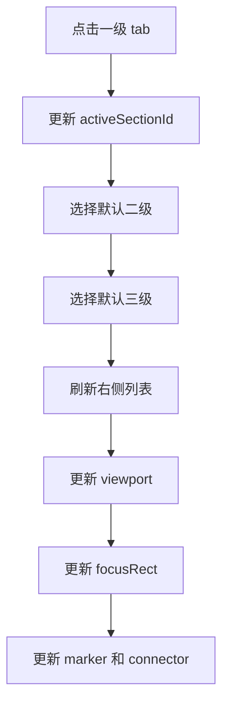
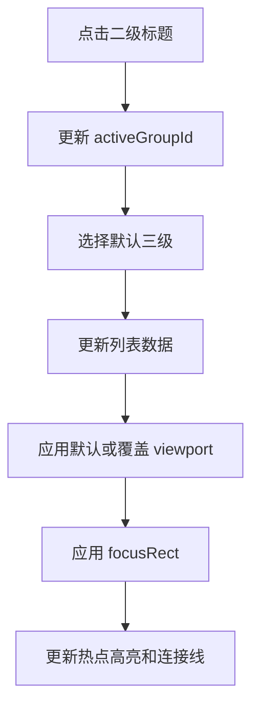
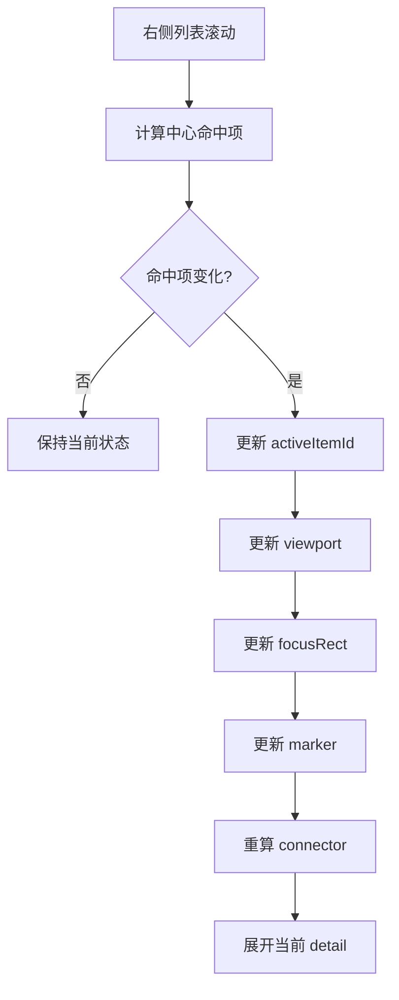
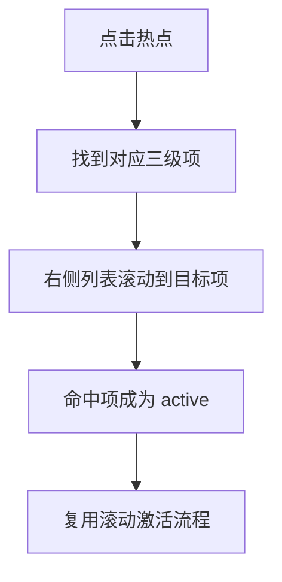
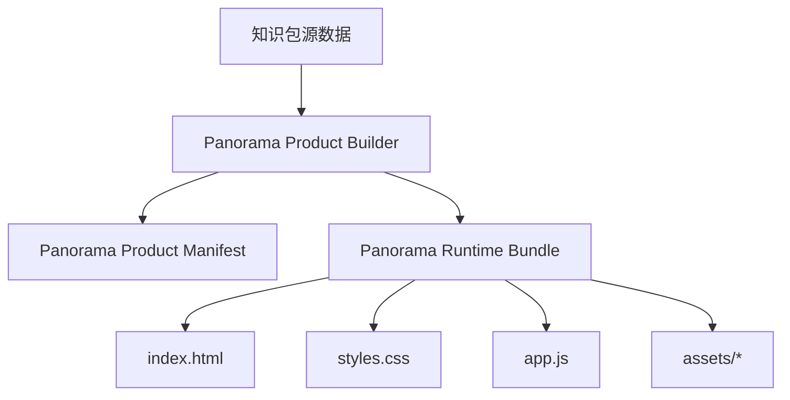

# 独立全景 HTML 产物详细设计

## 1. 文档目标

- 在《独立全景HTML产物方案设计》基础上，给出可直接进入实现阶段的详细设计。
- 固化正式共享类型草案、页面状态机详设、编辑器线框与操作流、打包架构草图。
- 作为后续共享类型实现、编辑器开发、运行时开发、打包接入的直接依据。

## 2. 文档范围

- 本文只覆盖中游/下游共用模板。
- 上游独立 HTML 节点仅保留接口预留，不展开具体交互设计。
- 本文不要求与当前 `surface` runtime 兼容。

## 3. 正式共享类型草案

### 3.1 设计原则

- 使用独立类型命名空间，避免与 `surface`、`html`、`image` 语义混淆。
- 将“结构数据”“画布数据”“运行时状态种子”分层。
- 将“默认继承配置”和“三级覆盖配置”显式分开。
- 将“背景视口”和“聚焦区域”拆为两个对象。

### 3.2 顶层对象

```ts
type PanoramaHtmlProduct = {
  id: string
  packageId: string
  version: string
  title: string
  productType: 'panorama-html'
  hintText: string
  globalPanoramaAsset?: PanoramaAssetRef
  theme?: PanoramaThemeTokens
  sections: PanoramaSection[]
  metadata: PanoramaMetadata
}

type PanoramaMetadata = {
  generatedAt?: string
  updatedAt?: string
  schemaVersion: '1.0.0'
}
```

### 3.3 一级、二级、三级结构

```ts
type PanoramaSection = {
  id: string
  label: string
  order: number
  defaultGroupId?: string
  groups: PanoramaGroup[]
}

type PanoramaGroup = {
  id: string
  title: string
  order: number
  panoramaAsset: PanoramaAssetRef
  defaultViewport: PanoramaViewport
  defaultItemId?: string
  items: PanoramaItem[]
}

type PanoramaItem = {
  id: string
  title: string
  description: string
  order: number
  marker: PanoramaMarker
  focusRect: PanoramaFocusRect
  viewportOverride?: PanoramaViewport
  connectorTarget?: PanoramaConnectorTarget
  detailBehavior?: PanoramaDetailBehavior
}
```

### 3.4 资源与画布对象

```ts
type PanoramaAssetRef = {
  assetId: string
  imageUrl: string
  width?: number
  height?: number
}

type PanoramaMarker = {
  x: number
  y: number
  style?: 'default' | 'highlight'
}

type PanoramaViewport = {
  centerX: number
  centerY: number
  zoom: number
}

type PanoramaFocusRect = {
  x: number
  y: number
  width: number
  height: number
  radius?: number
  maskOpacity?: number
}

type PanoramaConnectorTarget = {
  mode: 'divider-left'
  offsetX?: number
  offsetY?: number
}

type PanoramaDetailBehavior = {
  expandMode?: 'active-only'
  collapsedLines?: number
}
```

### 3.5 主题对象

```ts
type PanoramaThemeTokens = {
  panelBg?: string
  panelText?: string
  accentColor?: string
  maskColor?: string
  maskOpacity?: number
  connectorColor?: string
  connectorDash?: string
}
```

### 3.6 编辑器草稿对象

```ts
type PanoramaEditorDocument = {
  product: PanoramaHtmlProduct
  draftState: {
    selectedSectionId?: string
    selectedGroupId?: string
    selectedItemId?: string
    viewportMode?: 'group-default' | 'item-override'
    overlayMode?: 'marker' | 'focusRect' | 'connector'
  }
}
```

### 3.7 字段约束

- `hintText` 首期固定为 `点击或滑动文字查看简介`
- `PanoramaItem.focusRect` 必填，且每个三级项独立配置
- `PanoramaGroup.defaultViewport` 必填
- `PanoramaItem.viewportOverride` 可选；未填写时继承二级默认视口
- `PanoramaConnectorTarget.mode` 首期固定为 `divider-left`
- 所有 `x/y/width/height` 均使用相对于背景图的归一化坐标

### 3.8 与现有数据的映射关系

| 来源 | 新字段 | 说明 |
| --- | --- | --- |
| 一级结构 | `PanoramaSection` | 直接映射 |
| 二级结构 | `PanoramaGroup` | 直接映射 |
| 三级结构 | `PanoramaItem` | 直接映射 |
| 三级圆点坐标 | `PanoramaItem.marker` | 直接复用或拷贝 |
| 现有三级标题 | `PanoramaItem.title` | 直接复用 |
| 现有三级说明 | `PanoramaItem.description` | 直接复用 |
| 新增配置 | `focusRect / viewportOverride / connectorTarget` | 新编辑器专属 |

## 4. 运行时状态机详设

### 4.1 状态目标

- 保证一级、二级、三级切换规则稳定。
- 保证滚动激活与点击激活进入同一条状态链。
- 保证背景视口、聚焦框、连接线、热点高亮同步更新。

### 4.2 核心状态

```ts
type PanoramaRuntimeState = {
  activeSectionId: string
  activeGroupId: string
  activeItemId: string
  activeViewport: PanoramaViewport
  activeFocusRect: PanoramaFocusRect
  activeMarkerId: string
  scrollingItemId?: string
  interactionMode: 'idle' | 'scroll-sync' | 'hotspot-sync' | 'tab-switch' | 'group-switch'
}
```

### 4.3 初始化规则

1. 读取默认一级
2. 读取该一级的默认二级
3. 读取该二级的默认三级
4. 用三级项的 `viewportOverride ?? group.defaultViewport` 初始化视口
5. 用该三级项 `focusRect` 初始化聚焦框

### 4.4 一级切换流程



### 4.5 二级切换流程



### 4.6 滚动激活流程



### 4.7 热点反向联动流程



### 4.8 激活判定算法建议

- 容器中心线命中法：
  - 计算每个列表项中心点与容器中心线的距离
  - 取最小值项作为候选
  - 距离变化超过阈值时更新 active
- 为避免抖动，增加两个保护：
  - 滚动节流
  - 最小切换距离阈值

### 4.9 动画规则建议

- `viewport` 动画：
  - 时长 280ms 到 420ms
  - easing 使用缓出
- `focusRect` 动画：
  - 位置、宽高插值同步进行
  - 与 `viewport` 同步开始
- `connector`：
  - 每帧根据当前 `focusRect` 和当前 active 列表项位置重算

## 5. 编辑器线框与操作流

### 5.1 页面线框

```text
┌──────────────────────────────────────────────────────────────┐
│ 顶部工具栏: 保存 | 预览 | 打包 | 一级/二级快速切换            │
├──────────────┬───────────────────────────────┬───────────────┤
│ 左侧结构树   │ 中央全景画布                  │ 右侧属性面板  │
│              │                               │               │
│ 一级 tabs    │ 背景图                        │ 当前对象属性  │
│ 二级列表     │ 热点标点                      │ 标题/描述     │
│ 三级列表     │ 聚焦框                        │ 视口参数      │
│              │ 默认视口框                    │ 聚焦框参数    │
│              │ 虚线连接预览                  │ 连接点参数    │
└──────────────┴───────────────────────────────┴───────────────┘
```

### 5.2 左侧结构树交互

- 一级列表
  - 新增/删除/排序
  - 设置默认一级
- 二级列表
  - 新增/删除/排序
  - 继承全局全景图
  - 设置默认三级
- 三级列表
  - 新增/删除/排序
  - 点击即联动画布与属性面板

### 5.3 中央视图交互

- 背景图显示当前知识包配置的全局全景图
- 支持三种编辑模式：
  - 标点模式
  - 聚焦框模式
  - 视口模式
- 支持拖拽 marker
- 支持拉伸、移动 `focusRect`
- 支持直接调整默认视口中心和缩放
- 支持实时预览连接线终点

### 5.4 右侧属性面板

- 当选中二级时：
  - 编辑标题
  - 设置默认视口
  - 设置默认三级项
- 当选中三级时：
  - 编辑标题、描述
  - 设置 `marker`
  - 设置 `focusRect`
  - 设置 `viewportOverride`
  - 设置连接点偏移

### 5.5 典型操作流

#### 操作流 A：新增二级

1. 选择一级
2. 新增二级
3. 复用或更新全局全景图
4. 设定默认视口
5. 新增默认三级项

#### 操作流 B：配置三级项

1. 在左侧选中三级项
2. 在画布拖动热点标点
3. 框选聚焦区域
4. 调整视口覆盖区域
5. 填写右侧 detail 文案
6. 预览滚动激活效果

#### 操作流 C：校验交互

1. 进入预览模式
2. 滚动右侧列表
3. 检查背景移动、聚焦框、连接线、热点高亮
4. 返回编辑模式继续微调

## 6. 打包架构草图

### 6.1 架构目标

- 继续复用当前项目的知识包管理和构建入口
- 但针对 `panorama-html` 产物输出独立 bundle
- 打包后得到独立 HTML 页面，而不是复用当前 `player-host`

### 6.2 推荐分层



### 6.3 构建职责拆分

- **数据组装层**
  - 从现有知识包抽取一级/二级/三级基础结构
  - 读取独立编辑器产出的 panorama 配置
  - 合并为 `PanoramaHtmlProduct`
- **资源整理层**
  - 拷贝全景图资源
  - 生成相对路径引用
- **页面装配层**
  - 生成 `index.html`
  - 注入 `app.js`
  - 注入样式与主题 token

### 6.4 推荐目录结构

```text
data/panorama-bundles/{bundleId}/
├─ index.html
├─ styles.css
├─ app.js
├─ panorama-product.json
└─ assets/
   └─ panoramas/
      └─ *.png
```

### 6.5 与当前打包链路的关系

- 当前 `runtime-bundle.ts` 继续服务现有 runtime
- 新增 `panorama-runtime-bundle.ts` 或等价模块，服务独立全景 HTML 产物
- 包装层根据产物类型分流：
  - `interactive-runtime`
  - `panorama-html`

### 6.6 预览与正式打包一致性原则

- 管理端预览必须消费与正式 bundle 相同的数据结构
- 预览器与正式运行时应共享同一渲染核心
- 该渲染核心仅服务 `panorama-html`，不得与现有 `surface / interactive-runtime` 的 `player-host` 耦合
- 禁止出现“编辑器预览一套逻辑、正式 bundle 另一套逻辑”

## 7. 模块拆分建议

### 7.1 共享层

- `src/shared/panorama-types.ts`
- `src/shared/panorama-validators.ts`

### 7.2 编辑器层

- `src/admin/src/panorama-editor/`
  - `PanoramaEditorPage.tsx`
  - `PanoramaCanvas.tsx`
  - `PanoramaStructurePanel.tsx`
  - `PanoramaInspectorPanel.tsx`
  - `PanoramaRuntimePreviewModal.tsx`

### 7.3 运行时层

- `src/panorama-runtime/`
  - `panorama-host.ts`
  - `panorama-renderer.ts`
  - `panorama-state-machine.ts`
  - `panorama-connector.ts`
  - `player-core/panorama-player-host.ts`

### 7.4 服务端打包层

- `src/server/services/panorama-runtime-bundle.ts`
- `src/server/services/panorama-product-builder.ts`

### 7.5 当前已落地代码骨架

- 共享类型：
  - `src/shared/panorama-types.ts`
  - `src/shared/panorama-validators.ts`
- 运行时骨架：
  - `src/panorama-runtime/panorama-state-machine.ts`
  - `src/panorama-runtime/panorama-host.ts`
  - `src/panorama-runtime/panorama-renderer.ts`
  - `src/panorama-runtime/panorama-connector.ts`
  - `src/panorama-runtime/player-core/panorama-player-host.ts`
- 服务端骨架：
  - `src/server/services/panorama-product-builder.ts`
  - `src/server/services/panorama-runtime-bundle.ts`
- 编辑器骨架：
  - `src/admin/src/panorama-editor/PanoramaEditorPage.tsx`
  - `src/admin/src/panorama-editor/PanoramaStructurePanel.tsx`
  - `src/admin/src/panorama-editor/PanoramaCanvas.tsx`
  - `src/admin/src/panorama-editor/PanoramaInspectorPanel.tsx`
  - `src/admin/src/panorama-editor/PanoramaRuntimePreviewModal.tsx`
- 当前已具备的基础编辑能力：
  - 已接入管理端入口，工作台可直接跳转独立全景编辑器页面
  - 已完成第一轮管理端 UI 收口，统一为 Chakra 暗色编辑器样式，并修复文字可见性、边框语义和信息层次问题
  - 已完成第二轮 UI 精修，进一步优化工作区比例、树形结构导航、画布悬浮信息层和属性面板视觉层级
  - 已按最新交互要求收口：结构区一二级仅显示名称、移除画布内所有提示层、改为全局全景图设置、在画布中增加按图片宽高比例估算的视口预估框，并将默认 zoom 调整为 3.6
  - 左侧结构区切换一级、二级、三级对象
  - 左侧结构区新增、删除、上移、下移一级/二级/三级对象
  - 中央视图拖拽编辑 `marker`
  - 中央视图移动/缩放 `focusRect`
  - 中央视图拖拽编辑 `viewport center`
  - 顶部工具区支持保存到现有知识包本地持久化系统、打开本地运行时预览与重置视图
- 顶部工具区支持触发 panorama 独立打包，自动生成并打开独立 `panorama-bundle` 入口
  - 右侧属性区编辑全局全景图、二级标题、三级标题、三级描述、视口数值、`focusRect` 数值
  - 右侧属性区支持 `zoom` 数值输入与快捷增减
  - 管理端页面通过 `fetchGuide / updateGuide` 读写 `panoramaEditorDocument`，可直接恢复上次编辑结果
  - 管理端内置 `PanoramaRuntimePreviewModal`，且已改为挂载 panorama 独立 DOM 渲染核心进行本地运行时预览
  - 已新增 panorama 独立 player-core 构建入口，可产出 `panorama-player-host.js`
  - 已新增 `POST /api/guides/:id/panorama-package`，输出独立 `panorama-bundles/*` 目录与 `index.html / app.js / panorama-product.json`

## 8. 实施顺序建议

### 8.1 第一批

- 共享类型
- 编辑器草图页
- 运行时 demo

### 8.2 第二批

- 预览器联通
- 独立打包输出
- 示例包验证

### 8.3 第三批

- 上游独立 HTML 节点通信协议
- 与整体平台的多产物管理策略

## 9. 当前结论

- 该产物已经具备进入正式设计实现的文档基础。
- 后续研发可直接按本文档拆分任务：
  - 共享类型实现
  - 编辑器画布实现
  - 运行时状态机实现
  - 打包链路接入
