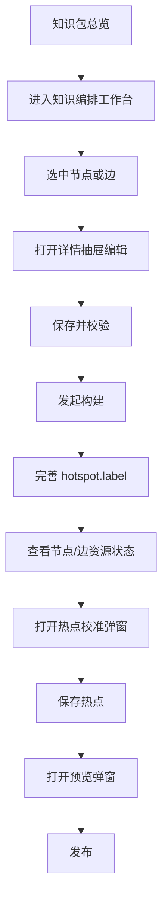

# Interactive Guide 管理端 UI 与操作流程设计

## 1. 文档目标

- 这份文档用于定义第一阶段管理端的核心形态。
- 管理端不做成传统表单后台，而是参考工作流产品的交互组织方式。
- 第一阶段 UI 目标很明确：
  1. 外层提供知识包总览与进入入口。
  2. 内层通过 `React Flow + 详情侧边抽屉` 完成节点与边的知识编排。
  3. 在同一套工作台内展示图片、视频、热点及其生成状态。
  4. 支持手动干预、弹窗预览、弹窗热点校准和发布。

## 2. 管理端定位

- 管理端本质上是“知识编排与资源构建工作台”。
- 它既不是单纯的导入页，也不是单纯的任务页。
- 它需要把四类动作串在一起：
  - 知识包管理
  - 节点与边编排
  - 资源生成与状态查看
  - 手动干预与校准

```text
知识包总览
-> 进入知识编排工作台
-> 编辑节点与边
-> 发起资源生成
-> 查看状态
-> 弹窗热点校准
-> 弹窗运行时预览
-> 发布
```

## 3. 第一阶段页面结构

### 3.1 页面总览

- 第一阶段建议收敛为 2 个核心页面/工作区：
  1. `知识包总览页`
  2. `知识编排工作台`

- 其中以下能力不再作为独立页面，而是在工作台中以弹窗方式打开：
  - `运行时预览`
  - `热点校准`

- 其中最核心的是 `知识编排工作台`。
- `构建任务状态` 不必单独拆成一级页面，可以先作为工作台中的一块面板或抽屉区域。

## 4. 页面设计

### 4.1 知识包总览页

#### 页面目标

- 展示所有知识包。
- 作为进入编排工作台、发起构建和查看整体状态的入口。

#### 建议模块

- 顶部操作区
  - `导入 JSON`
  - `导出知识包`
  - `新建知识包`
  - `筛选状态`
- 卡片或表格列表区
  - `标题`
  - `版本`
  - `分辨率`
  - `节点数`
  - `边数`
  - `最近构建状态`
  - `更新时间`
- 行操作
  - `进入工作台`
  - `发起构建`
  - `预览`
  - `导出`
  - `删除`

#### 设计原则

- 这一页只负责“看包”和“进入包”，不要承载具体编排细节。
- 但它需要承担“导出当前知识包”的职责，因为导出是包级操作，不属于单节点或单边编辑。

### 4.2 知识编排工作台

#### 页面目标

- 使用 `React Flow` 作为中心画布进行节点与边编排。
- 使用右侧详情抽屉承接节点、边和知识包的具体编辑。
- 在图上直接可视化资源状态，支持运营快速判断当前哪些节点或边还需要处理。
- 在工作台里还要直接处理“每条 hotspot 对应画面的哪个重点对象”这件事，也就是 `hotspot.label`。

#### 页面结构

- 顶部工具栏
  - `返回知识包总览`
  - `保存`
  - `运行校验`
  - `发起构建`
  - `打开预览`
  - `发布`
- 左侧辅助区
  - `节点/边快速列表`
  - `筛选失败项`
  - `筛选未生成资源项`
- 中间主区域
  - `React Flow 知识编排画布`
- 右侧区域
  - `详情侧边抽屉`

#### 画布层建议

- 节点展示：
  - 节点标题
  - 节点类型或呈现意图摘要
  - 图片状态
  - 热点数量
- 边展示：
  - 关系文案
  - 视频状态
- 状态表现建议：
  - `idle`
  - `running`
  - `success`
  - `failed`

#### 状态可视化建议

- 节点图片状态使用小图标或角标区分。
- 边视频状态使用线条颜色或边标签区分。
- 失败状态应支持一眼筛出，避免运营在大图里逐个找。

### 4.3 详情侧边抽屉

#### 抽屉目标

- 承接当前选中对象的具体编辑，不打断画布上下文。
- 抽屉根据当前选中对象切换三种模式：
  - `知识包抽屉`
  - `节点抽屉`
  - `边抽屉`

#### A. 知识包抽屉

- 建议字段：
  - `title`
  - `version`
  - `description`
  - `resolution.width`
  - `resolution.height`
  - `visualStyle`
  - `transitionStyle`

#### B. 节点抽屉

- 建议字段：
  - `id`
  - `title`
  - `keyContent`
  - `presentationIntent`
  - `imageUrl`
  - `imageStatus`
  - `hotspots`
  - `status`

- 建议操作：
  - `保存节点`
  - `重跑节点图片`
  - `查看节点图片`
  - `编辑热点 label`
  - `打开热点校准`

#### C. 边抽屉

- 建议字段：
  - `id`
  - `fromNodeId`
  - `toNodeId`
  - `relationLabel`
  - `videoUrl`
  - `videoStatus`
  - `status`

- 建议操作：
  - `保存边`
  - `重跑边视频`
  - `查看视频`

### 4.4 热点校准弹窗
#### 弹窗目标

- 在不离开工作台的前提下校准当前节点下的所有子节点热点。
- 热点校准不是从零开始点点位，而是基于 `hotspot.label` 做落点确认。

#### 弹窗布局建议

- 顶部：
  - 当前节点标题
  - `保存校准结果`
  - `根据 label 重新推荐`
  - `关闭`
- 中间：
  - 一张节点主图
  - 叠加多个可拖拽的响应式 hotspots
- 底部或右侧简表：
  - `relationLabel`
  - `targetNodeId`
  - `label`
  - `status`

#### 画布能力

- 显示节点主图
- 叠加白点热点
- 允许拖拽热点
- hotspot 位置基于图片尺寸自适应换算，保存时回写 `normalizedX / normalizedY`
- 高亮当前选中热点
- 显示目标节点名称
- 支持新增和删除热点

#### 推荐实现方式

- 弹窗主体是一张固定比例的图片容器。
- 所有热点以绝对定位方式覆盖在图片上。
- 拖拽过程中基于容器宽高实时换算为归一化坐标。
- 渲染时优先用 `normalizedX / normalizedY` 还原位置，保证不同尺寸下表现一致。

### 4.5 运行时预览弹窗

#### 弹窗目标

- 用接近真实用户端的方式验证最终体验。
- 重点不是编辑，而是确认：
  - 节点跳转是否合理
  - 白点是否好点
  - 视频是否匹配

#### 建议能力

- 从 `root` 节点开始预览
- 点击热点进入下一页
- 播放转场视频
- 显示当前节点 id 与当前边 id
- 支持一键关闭并回到工作台

## 5. 典型操作链路



## 6. 状态设计

### 6.1 为什么状态必须直接体现在节点和边上

- 既然工作台是以 `React Flow` 为核心，那么节点和边本身就应该携带状态。
- 运营在画布里最关心的是：
  - 这个节点的图生成了吗
  - 这条边的视频生成了吗
  - 这个热点是否已经定义了清晰的 label
  - 哪些对象失败了
- 如果状态只在独立任务页里，工作台会丢失最关键的操作反馈。

### 6.2 推荐状态集合

- 节点图片状态：
  - `idle`
  - `running`
  - `success`
  - `failed`
- 边视频状态：
  - `idle`
  - `running`
  - `success`
  - `failed`
- 整体节点/边状态：
  - `draft`
  - `ready`
  - `archived`

## 7. 手动干预点设计

### 7.1 第一阶段建议支持的人工干预动作

- 修改知识包全局风格配置
- 修改节点的 `keyContent`
- 修改节点的 `presentationIntent`
- 修改 `hotspots.label`
- 重跑单个节点图片
- 重跑单条边视频
- 手动拖拽和保存热点
- 删除或新增热点

### 7.2 不建议第一阶段支持的复杂能力

- 不做多人协同编辑
- 不做复杂权限系统
- 不做自动布局之外的复杂图编辑器功能
- 不做完整素材资产中心

## 8. 推荐的数据对象

### 8.1 管理端总览对象

```ts
interface PackageListItem {
  id: string
  title: string
  version: string
  resolution: { width: number; height: number }
  nodeCount: number
  edgeCount: number
  latestBuildStatus?: 'idle' | 'running' | 'success' | 'failed'
  updatedAt?: string
  exportStatus?: 'idle' | 'running' | 'success' | 'failed'
}
```

### 8.2 工作台对象

```ts
interface FlowNodeData {
  id: string
  title: string
  presentationIntent?: string
  imageStatus?: 'idle' | 'running' | 'success' | 'failed'
  hotspotCount?: number
}

interface FlowEdgeData {
  id: string
  relationLabel?: string
  videoStatus?: 'idle' | 'running' | 'success' | 'failed'
}
```

### 8.3 校准对象

```ts
interface AnchorEditorRecord {
  edgeId: string
  targetNodeId: string
  label: string
  imageUrl: string
  x: number
  y: number
  normalizedX: number
  normalizedY: number
  radius?: number
  status?: 'idle' | 'running' | 'success' | 'failed'
}
```

## 9. 简化版信息架构建议

```text
/packages
/packages/:packageId/workbench
```

- 工作台是核心路由，节点与边编辑通过抽屉完成，预览和热点校准通过弹窗完成，不必为每个对象单独拆详情页。

## 10. 管理端与后端接口关系

### 10.1 第一阶段建议的接口域

- `package`
  - 导入知识包
  - 导出知识包
  - 查询总览
  - 查询详情
  - 更新知识包配置
- `node`
  - 更新节点
  - 更新节点热点
  - 重跑节点图片
- `edge`
  - 更新边
  - 重跑边视频
- `anchor`
  - 更新热点位置
  - 新增热点
  - 删除热点
- `build`
  - 发起构建
  - 查询构建状态
- `publish`
  - 生成预览包
  - 发布版本

### 10.2 为什么节点、边、热点接口要分开

- 因为三者虽然都在工作台里操作，但语义完全不同。
- 分开后：
  - 抽屉提交逻辑更清晰
  - 失败重试边界更清晰
  - 后续资源重跑也更容易控制

## 11. 第一阶段 UI 实现建议

### 11.1 技术策略

- 管理端继续基于 React。
- 核心编排区域使用 `React Flow`。
- 详情编辑采用右侧抽屉。
- 运行时预览采用弹窗。
- 热点校准采用弹窗中的大图容器 + 响应式拖拽 hotspots。

### 11.2 优先级排序

- 最高优先级：
  - 知识包总览页
  - 知识编排工作台
  - 详情侧边抽屉
  - 热点校准弹窗
- 次优先级：
  - 运行时预览弹窗
- 最后再补：
  - 发布历史
  - 构建历史

## 12. 最终建议

- 第一阶段先把管理端做成“可编排、可生成、可校准”的工作台，而不是传统后台表单系统。
- 真正的交互核心不是表格，而是 `React Flow 画布 + 详情抽屉 + 热点校准弹窗 + 预览弹窗`。
- 外层用知识包总览承接入口，内层用工作台承接节点和边的全流程操作。
- 这样最贴合你提到的目标：既能做知识编排，也能直接承接资源生成状态和人工干预。
