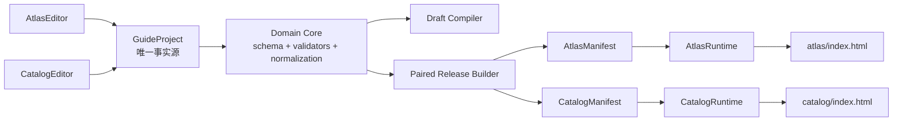
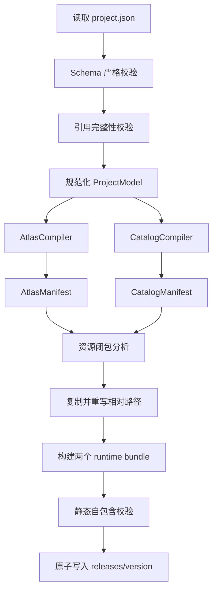

# Interactive Guide 双产品架构重构方案

> 日期：2026-06-29
> 最后更新：2026-06-30
> 状态：待评审
> 范围：数据模型、编辑器、运行时、服务端、静态产物、存储、测试与遗留删除
> 核心约束：不保留旧数据兼容层；AIGC 能力整体删除；一个项目必须配套产出两份独立 HTML。

## 1. 重构结论

项目应从“通用 Node/Edge AIGC 导览系统”重构为“产业链互动内容编辑与双产品编译系统”。

重构后的核心关系为：

```text
一个 GuideProject（唯一事实源）
  ├─ 固定的上游 / 中游 / 下游三级知识结构
  ├─ 一张共享全景图及其空间标注
  ├─ 0..N 个自包含 HTML 场景包
  ├─ 0..N 条展示状态之间的视频转场
  ├─ 两套产品级配置
  └─ 项目级埋点参数

编译后同时得到：
  ├─ Atlas HTML：总图自由探索产物
  └─ Catalog HTML：结构化知识导览产物
```

两套编辑器和两套运行时继续保留，但不得继续各自保存一份知识结构和全景图。它们必须共享同一个项目领域模型，只维护各自真正特有的交互与视觉配置。

## 2. 现状问题与重构动因

### 2.1 同一内容存在多份事实源

以 `data/workspace/guide_surface_validation_001` 为例，同一产业链内容同时存在于：

- `root.extensions.surfaceHierarchyCatalog`
- `root.surfaceLayers`
- `panoramaEditorDocument.product.sections`
- `manifest.json` 中再次复制的节点、图层和边

结果是内容、空间标注和运行时配置可能独立漂移。当前样例中目录知识有 34 个三级知识项，但 `surfaceLayers` 和 Panorama items 只表达了其中 16 个；上游知识实际由 HTML 场景内部再次维护。

### 2.2 两套产品命名和职责混淆

当前存在：

- `src/runtime`：实际承担总图 `surface` 漫游、HTML 节点和视频边。
- `src/panorama-runtime`：实际承担上中下游标签、知识列表、聚焦框和 HTML group。
- `runtime-bundles` 与 `panorama-bundles`：名字无法直接表达产品差异。
- `SurfaceNodeDesigner` 与 `PanoramaEditorPage`：都在编辑全景图，但数据结构互不统一。

### 2.3 样例业务进入了通用程序

已确认的错误硬编码包括：

- 按一级名称 `上游` 自动创建 HTML group。
- 把 `中游/下游` 视为必须存在的全景图层。
- 在运行时内置火箭、卫星部件名称和 `rocket.html` 路径识别。
- 埋点名称固定为 `商业航天`。
- 默认提示语、默认 zoom、375×808 默认比例本身合理，但目前以魔法值重复散落，缺少统一默认配置入口。
- 默认使用 `targetOrigin: '*'`。
- 股票名称、股票路由和 `client.html` 跳转混入通用卡片模型。
- 热点样式通过任意 CSS 字符串保存，项目样式直接穿透运行时。

### 2.4 旧 AIGC 主干已不再匹配产品方向

旧架构仍围绕以下对象运转：

- `KnowledgeNode / KnowledgeEdge`
- 节点生图、热点视觉推荐、边视频生成
- Generate 任务、重跑、日志和中间记录
- `PublishManifest` 的 nodeMap/edgeMap
- React Flow 图编辑工作台

未来内容量产依赖编辑、导入素材和静态打包，这套主干只会增加理解、测试和维护成本，应整体退出。

## 3. 双产品正式命名

为避免继续使用含义重叠的 `runtime / panorama / surface`，建议采用以下命名：

| 产品 | 中文名 | 稳定代码名 | 核心体验 | 现有来源 |
| --- | --- | --- | --- | --- |
| Product A | 全景探索产物 | `atlas` | 总图自由缩放、拖拽、热点/卡片、进入 HTML 场景、视频转场 | 当前 `surface runtime` |
| Product B | 结构导览产物 | `catalog` | 上中下游 tabs、二级分类、三级列表、聚焦框、HTML 场景 | 当前 `panorama runtime` |

配套命名：

| 概念 | Atlas | Catalog |
| --- | --- | --- |
| 编辑器 | `AtlasEditor` | `CatalogEditor` |
| 运行时 | `AtlasRuntime` | `CatalogRuntime` |
| 发布契约 | `AtlasManifest` | `CatalogManifest` |
| 编译器 | `AtlasCompiler` | `CatalogCompiler` |
| 产物目录 | `atlas/` | `catalog/` |
| 独立包 | `atlas-bundle` | `catalog-bundle` |

`panorama` 只表示共享的全景图片与空间坐标模型，不再作为某一套产品的名字。

## 4. 目标总体架构



### 4.1 分层原则

1. `domain` 只表达项目内容和编辑状态，不依赖 React、Express 或 DOM。
2. `products/atlas` 和 `products/catalog` 只读取规范化后的领域数据。
3. 两套运行时互不依赖，但共享场景协议、转场控制器、埋点适配器和资源加载工具。
4. 编辑器预览与正式产物使用同一编译器和同一运行时。
5. 发布产物只使用相对路径，不依赖 Express API。
6. 两份 HTML 作为同一个 release 原子发布：任意一份构建失败，整个 release 失败。
7. 合理的产品默认值继续保留，但集中在唯一默认配置模块；编辑器和编译器不得各自复制魔法值。

## 5. 唯一项目数据模型

### 5.1 顶层模型

```ts
interface GuideProject {
  schemaVersion: '2.0.0'
  id: string
  title: string
  version: string
  locale: string

  knowledge: IndustryChain
  assets: AssetRegistry
  panorama: PanoramaModel
  scenes: HtmlScenePackage[]
  navigation: ExperienceNavigation

  products: {
    atlas: AtlasProductConfig
    catalog: CatalogProductConfig
  }

  integrations: ProjectIntegrations
  metadata: ProjectMetadata
}
```

必须删除以下顶层概念：

- `nodes`
- `edges`
- `rootNodeId`
- `resolution: '375*808'`
- `visualStyle / transitionStyle`
- `panoramaEditorDocument`
- `surfaceHierarchyCatalog`
- AIGC build status 和 provider 状态

### 5.2 固定产业链结构

```ts
type IndustryStageKey = 'upstream' | 'midstream' | 'downstream'

interface IndustryChain {
  stages: [IndustryStage, IndustryStage, IndustryStage]
  items: Record<string, IndustryItem>
}

interface IndustryStage {
  key: IndustryStageKey
  label: string
  order: 1 | 2 | 3
  categories: IndustryCategory[]
}

interface IndustryCategory {
  id: string
  title: string
  order: number
  description?: string
  itemIds: string[]
  experience: CategoryExperienceBinding
}

interface IndustryItem {
  id: string
  categoryId: string
  title: string
  description: string
  order: number
  tags?: string[]
}
```

分类只保存 `itemIds`。这样可以避免嵌套编辑时整棵树复制，也便于空间标注和场景映射通过稳定 ID 引用。

校验器必须保证：

- stages 数量严格为 3。
- key 和顺序严格为 `upstream → midstream → downstream`。
- 三个 stage 不允许删除、复制或改 key。
- label 首期固定显示为 `上游 / 中游 / 下游`。
- category 和 item ID 在项目内唯一。
- item 必须且只能属于一个 category。
- order 连续且无重复。

### 5.3 统一资源注册表

```ts
type AssetKind = 'image' | 'video' | 'html-bundle'

interface AssetDefinition {
  id: string
  kind: AssetKind
  sourcePath: string
  entryPath?: string
  mimeType?: string
  width?: number
  height?: number
  sha256?: string
}

interface AssetRegistry {
  byId: Record<string, AssetDefinition>
}
```

规则：

- 编辑态只保存 `assetId`，禁止保存 `/api/media/workspace/...` URL。
- `sourcePath` 必须是项目目录内的相对路径。
- HTML bundle 必须声明 `entryPath`。
- 编译器负责复制、去重、hash 和重写成包内相对 URL。
- 找不到资源时构建失败，不允许回退占位图或保留后台 API URL。

### 5.4 共享全景空间模型

```ts
interface PanoramaModel {
  assetId: string
  coordinateSpace: 'normalized'
  cameraBounds: {
    minZoom: number
    maxZoom: number
  }
  initialViewport: Viewport
  categories: Record<string, CategorySpatialLayout>
  items: Record<string, ItemSpatialLayout>
}

interface Viewport {
  centerX: number
  centerY: number
  zoom: number
}

interface CategorySpatialLayout {
  viewport: Viewport
  activationZoom?: number
  hotspot?: NormalizedPoint
}

interface ItemSpatialLayout {
  marker: NormalizedPoint
  focusRect: NormalizedRect
  viewportOverride?: Viewport
  callout?: {
    dock: 'top' | 'right' | 'bottom' | 'left'
    target: NormalizedPoint
  }
}
```

共享原则：

- 知识标题和描述只存在于 `knowledge`。
- 全景图只通过 `panorama.assetId` 声明一次。
- marker、focusRect 和 viewport 只存在于 `panorama`。
- Atlas 的卡片和 Catalog 的列表通过 itemId 读取同一份知识内容。
- 产品级配置只能控制“如何显示”，不能复制知识正文。

### 5.5 HTML 场景模型

```ts
interface HtmlScenePackage {
  id: string
  title: string
  assetId: string
  protocol: {
    channel: 'interactive-guide:scene-bridge'
    version: '1.0.0'
  }
  views: HtmlSceneView[]
}

interface HtmlSceneView {
  id: string
  title: string
  activationMessage: {
    type: string
    payload?: Record<string, unknown>
  }
  categoryIds: string[]
  itemFocusMap?: Record<string, SceneFocusCommand>
}

type CategoryExperienceBinding =
  | { kind: 'panorama' }
  | { kind: 'html-scene'; sceneId: string; viewId: string }
```

该设计支持：

- 当前一个 HTML 场景同时提供火箭、卫星两个 view。
- 未来多个二级分类绑定不同 HTML 场景。
- 多个分类复用同一场景的不同 view。
- 项目知识仍完整保存，即使某分类由场景负责呈现。

不再允许：

- 根据 `上游` 文字判断是否使用 HTML。
- 根据 HTML 文件名识别火箭场景。
- 在运行时保存已知火箭/卫星部件名称集合。
- 使用无协议约束的任意 `postMessage`。

`targetOrigin` 在独立包中应由运行时根据 bundle origin 推导；只有跨域场景才允许项目显式配置 origin，禁止默认 `*`。

### 5.6 可扩展视频转场模型

视频转场不再建模为知识图谱 Edge，而是“体验位置之间的可选展示路由”：

```ts
type ExperienceLocation =
  | { kind: 'panorama'; categoryId?: string; itemId?: string }
  | { kind: 'scene'; sceneId: string; viewId?: string }

interface ExperienceRoute {
  id: string
  from: ExperienceLocation
  to: ExperienceLocation
  transition?: {
    kind: 'video'
    assetId: string
    posterAssetId?: string
    timeoutMs?: number
    onFailure: 'abort-navigation' | 'cut'
  }
}

interface ExperienceNavigation {
  routes: ExperienceRoute[]
}
```

这样既能表达当前“全景图 → 3D 场景”，也能保留：

- 3D 场景 → 全景图
- 场景 view → 另一个场景 view
- 全景分类 → 另一个全景分类
- 不同方向使用不同视频

运行时只解析实际发生的路由，不恢复旧的任意 node/edge 图编辑器。

### 5.7 两套产品配置

```ts
interface AtlasProductConfig {
  enabled: true
  viewport: ProductViewportConfig
  theme: AtlasTheme
  chrome: ProductChromeConfig
  interaction: {
    wheelZoom: boolean
    dragPan: boolean
    pinchZoom: boolean
    resetCameraEnabled: boolean
  }
  categoryIds: string[]
  hintText?: string
}

interface CatalogProductConfig {
  enabled: true
  viewport: ProductViewportConfig
  theme: CatalogTheme
  chrome: ProductChromeConfig
  interaction: {
    listActivation: 'center-nearest'
    markerActivation: boolean
    viewportAnimationMs: number
  }
  stageOrder: IndustryStageKey[]
  hintText?: string
}
```

产品配置中可以有不同的主题、提示文案、入口状态和 UI chrome，但不能再次保存 stages/categories/items、全景图片或场景资源。

默认值由统一配置模块创建，项目保存后则以项目字段为准。运行时不得直接依赖编辑器默认配置。

### 5.8 项目级埋点与分享配置

```ts
interface ProjectIntegrations {
  analytics?: {
    enabled: boolean
    provider: 'weblog'
    profileId: string
    pageType: string
    contentName?: string
    defaultSource?: string
    dimensions?: Record<string, string>
  }
  share?: {
    enabled: boolean
    title?: string
    description?: string
    imageAssetId?: string
  }
}
```

设计规则：

- 初始化曝光、点击、停留、分享、回流等触发时机由共享 analytics adapter 实现。
- `contentName` 默认取 `project.title`；`商业航天` 只存在于项目实例数据。
- provider 脚本地址、非公开凭据和部署级参数由环境配置或 `profileId` 对应的部署配置提供。
- 两套 HTML 使用相同埋点参数和事件语义，但分别附加 `product: atlas | catalog` 维度。
- 删除股票数组、股票代码、`client.html` 路由、`open-route` action 以及相关 bridge 请求。

### 5.9 默认配置集中治理

默认提示语、默认 zoom 和 375×808 默认画布不是业务硬编码，应保留为产品默认值。问题只在于它们当前散落在多个组件和构建函数中。

建议新增唯一配置入口：

```ts
// src/config/project-defaults.ts
export const PROJECT_DEFAULTS = {
  viewport: {
    width: 375,
    height: 808,
  },
  panorama: {
    minZoom: 1,
    maxZoom: 4,
    categoryZoom: 3.6,
    focusRect: {
      width: 0.22,
      height: 0.18,
      radius: 12,
      maskOpacity: 0.48,
    },
  },
  products: {
    atlas: {
      hintText: '拖动或缩放探索全景图',
    },
    catalog: {
      hintText: '点击或滑动文字查看简介',
      viewportAnimationMs: 360,
    },
  },
} as const
```

治理规则：

- 该文件只保存通用、稳定、无项目语义的默认值。
- `createProject()` 和 Agent 初始化 Skill 使用该配置创建完整草稿。
- 项目创建后需要调整的值显式保存在 `project.json`，不再依赖隐式 fallback。
- 编辑器中的“恢复默认值”也读取该模块。
- 编译器只消费已经规范化的 ProjectModel；缺失必填配置时失败，不临时猜默认值。
- `商业航天`、火箭/卫星名称、资源路径、埋点内容名不允许进入默认配置。
- UI 颜色、间距、字体等视觉 token 放入独立 `editor-theme.ts`，不与项目业务默认值混合。

## 6. 两套发布契约

### 6.1 AtlasManifest

只包含 AtlasRuntime 需要的数据：

- 项目基本信息
- 归一化知识索引
- 全景图相对 URL
- camera bounds、category viewport、item marker/callout
- HTML scene 及 scene view 绑定
- Atlas 可达的 ExperienceRoute
- Atlas theme/chrome/interaction
- analytics/share 公共配置

不包含：

- editor draft state
- Catalog 列表布局
- nodeMap/edgeMap
- AIGC 状态
- workspace URL

### 6.2 CatalogManifest

只包含 CatalogRuntime 需要的数据：

- 固定三段产业链及完整分类/知识项
- 全景图相对 URL
- category viewport、item marker/focusRect
- HTML scene view 绑定
- Catalog 可达的 ExperienceRoute
- Catalog theme/chrome/interaction
- analytics/share 公共配置

不包含 Atlas 独有的自由漫游卡片布局。

### 6.3 ReleaseManifest

```ts
interface ReleaseManifest {
  projectId: string
  projectVersion: string
  schemaVersion: '1.0.0'
  generatedAt: string
  sourceRevision: number
  products: {
    atlas: { entry: './atlas/index.html'; manifest: './atlas/manifest.json' }
    catalog: { entry: './catalog/index.html'; manifest: './catalog/manifest.json' }
  }
}
```

发布目录：

```text
data/
├─ projects/{projectId}/
│  ├─ project.json
│  └─ assets/
│     ├─ images/
│     ├─ videos/
│     └─ scenes/{sceneAssetId}/...
├─ draft-builds/{projectId}/{buildId}/
└─ releases/{projectId}/{version}/
   ├─ release.json
   ├─ atlas/
   │  ├─ index.html
   │  ├─ app.js
   │  ├─ manifest.json
   │  └─ assets/...
   └─ catalog/
      ├─ index.html
      ├─ app.js
      ├─ manifest.json
      └─ assets/...
```

两套包允许复制各自所需的共享资源。后续若部署平台支持公共父目录，可增加 release 级 shared assets 优化，但首期优先保证每份 HTML 目录可被独立搬运和部署。

## 7. 目标代码目录

```text
src/
├─ config/
│  ├─ project-defaults.ts
│  └─ editor-theme.ts
├─ domain/
│  ├─ project-types.ts
│  ├─ project-schema.ts
│  ├─ project-validator.ts
│  ├─ project-normalizer.ts
│  ├─ asset-types.ts
│  ├─ scene-protocol.ts
│  └─ experience-navigation.ts
├─ products/
│  ├─ atlas/
│  │  ├─ contract/
│  │  ├─ compiler/
│  │  └─ runtime/
│  └─ catalog/
│     ├─ contract/
│     ├─ compiler/
│     └─ runtime/
├─ platform/
│  ├─ scene-bridge/
│  ├─ transition-video/
│  ├─ analytics/
│  ├─ sharing/
│  └─ asset-loader/
├─ server/
│  ├─ routes/
│  │  ├─ projects.ts
│  │  ├─ assets.ts
│  │  ├─ previews.ts
│  │  └─ releases.ts
│  ├─ services/
│  │  ├─ project-service.ts
│  │  ├─ asset-service.ts
│  │  ├─ draft-build-service.ts
│  │  └─ release-service.ts
│  └─ storage/
└─ admin/
   └─ src/
      ├─ app/
      ├─ shared/
      │  ├─ project-context/
      │  ├─ knowledge-editor/
      │  ├─ asset-library/
      │  ├─ scene-manager/
      │  └─ integration-settings/
      └─ editors/
         ├─ atlas/
         └─ catalog/
```

项目级 Agent Skill 独立放置：

```text
skills/guide-project-bootstrap/
├─ SKILL.md
├─ agents/openai.yaml
├─ scripts/
│  ├─ bootstrap-project.ts
│  └─ validate-project.ts
└─ references/
   ├─ input-contract.md
   └─ project-schema.md
```

## 8. 编辑器重构

编辑器重构不是现有页面的改名或换色。当前场景定位依赖大量数值输入，画布、结构树和运行时预览割裂，基础操作路径过长。AtlasEditor 与 CatalogEditor 都需要围绕“在画布上直接完成配置”重新设计交互。

### 8.1 共享管理壳

两套编辑器保持独立路由和独立工作区，但共享：

- `ProjectContext`：加载、revision、保存状态、脏状态。
- 产业链结构编辑器：上中下游、分类、知识项。
- 资源库：全景图、视频、HTML bundle。
- HTML 场景管理器：场景、view、分类绑定、激活消息。
- 埋点与分享配置。
- schema 校验结果面板。
- 预览和配套发布入口。
- 统一命令系统：撤销、重做、复制、粘贴、删除、保存、预览和快捷键。
- 统一选择模型：当前 stage、category、item、scene、route 和画布对象。
- 自动保存状态、revision 冲突提示和可恢复的本地操作历史。

建议路由：

```text
/projects
/projects/:projectId/atlas-editor
/projects/:projectId/catalog-editor
/projects/:projectId/settings
/projects/:projectId/releases
```

### 8.2 AtlasEditor 职责

- 编辑自由漫游 camera bounds 和 initial viewport。
- 编辑分类热点与 category viewport。
- 编辑知识项 marker、callout 和 Atlas 展示规则。
- 配置场景入口及体验路由。
- 预览视频转场。
- 使用 AtlasRuntime 做真实预览。
- 在真实全景画布上通过拖拽和滚轮定位，不要求用户先理解归一化坐标。
- 提供“将当前镜头保存为分类视口”和“恢复项目默认视口”操作。
- 支持在画布上单击创建 hotspot，拖拽调整位置，按方向键进行像素级微调。
- 支持 callout 端点和停靠方向的直接操控，不把主要操作藏进数值表单。
- 提供 minimap、图层可见性、当前 zoom、鼠标坐标和安全边界提示。

### 8.3 CatalogEditor 职责

- 只读展示固定的上中下游一级结构，不允许删除一级。
- 编辑二级分类和三级知识项顺序。
- 编辑 category viewport、item marker、focusRect、viewportOverride。
- 选择分类呈现方式：panorama 或绑定 HTML scene view。
- 使用 CatalogRuntime 做真实预览。
- 提供连续校准模式：完成一个 item 后自动切换下一个 item。
- marker 使用单击定位或直接拖拽；focusRect 使用框选、移动和四角缩放。
- 提供“使用当前镜头”“适配 focusRect”“复制上一项视口”“清除覆盖”快捷操作。
- 结构树、画布选中项和右侧运行时列表保持双向同步。
- panorama 与 HTML scene 的切换必须在同一画布工作区内预览，不跳转到另一套页面。

### 8.4 防止双编辑器覆盖

当前整包 `PUT /guides/:id` 容易让两个页面互相覆盖。新接口需要：

- `project.revision` 单调递增。
- 保存请求携带 `expectedRevision`。
- revision 不匹配返回 409，禁止最后写入者静默覆盖。
- 领域 patch 按边界保存，例如 knowledge、panorama、atlasConfig、catalogConfig。
- 编辑器收到新 revision 后重新合并或提示刷新。

### 8.5 编辑器信息架构与关键操作流

#### 桌面工作区

```text
┌────────────────────────────────────────────────────────────────────────┐
│ 56px 顶栏：项目 / 产品切换 / 保存状态 / 撤销重做 / 预览 / 配套发布      │
├──────────────┬───────────────────────────────────┬─────────────────────┤
│ 结构与资源区 │ 主画布                            │ 上下文属性区        │
│ 260~300px    │ 自适应，始终占最大面积            │ 300~340px           │
│              │                                   │                     │
│ 知识结构     │ 画布工具条                        │ 当前对象关键属性    │
│ 场景         │ 全景图/HTML 场景                  │ 快捷动作优先        │
│ 视频转场     │ marker/focus/viewport/callout     │ 数值输入折叠为高级  │
├──────────────┴───────────────────────────────────┴─────────────────────┤
│ 28px 状态栏：zoom / 坐标 / 选中对象 / 校验错误 / revision              │
└────────────────────────────────────────────────────────────────────────┘
```

布局原则：

- 主画布在 1440px 宽度下至少占 60%，左右面板均可折叠。
- 属性面板只展示当前对象有关字段，禁止把全部 schema 平铺成超长表单。
- 高频动作在画布附近完成；精确数值作为二级能力。
- 编辑模式、预览模式和校准模式视觉上明确区分。
- 小于 1100px 时右侧属性区改为抽屉，不压缩画布到不可用宽度。

#### 场景定位主流程

```text
在结构树选择 category/item
→ 画布自动移动到已有位置
→ 滚轮/拖拽调整镜头
→ 点击“记录当前视口”
→ 单击放置 marker
→ 拖拽框选 focusRect
→ 运行时预览即时更新
→ 保存并自动进入下一项
```

目标是让常见 item 的定位不再需要手工填写 `centerX / centerY / zoom / x / y / width / height` 七个以上数值。

可用性验收基线：

- 已熟悉工具的运营配置一个普通 panorama item 时，只需完成“选项、记录镜头、放 marker、框 focusRect、确认”这一条连续流程。
- 连续配置 10 个 item 期间不需要离开主画布或打开独立数值弹窗。
- Atlas category viewport 和 Catalog item viewport 均可一键记录当前画布状态。
- 精确数值输入保留，但不得成为完成基础定位的必经步骤。

#### 必须支持的效率能力

- Undo/Redo 至少覆盖最近 50 次编辑操作。
- `Cmd/Ctrl+S` 保存，`Cmd/Ctrl+Z` 撤销，`Shift+Cmd/Ctrl+Z` 重做。
- `V/M/F/C` 切换选择、marker、focusRect、callout 工具。
- 方向键微调 1px，按住 Shift 微调 10px。
- category/item 搜索和命令面板。
- 批量复制 viewport/focusRect 配置。
- 显示未定位、部分定位、已完成状态，并支持按状态筛选。
- 资源替换后保留归一化空间配置，同时明确提示比例变化风险。
- 自动保存不得中断拖拽；拖拽结束后合并为一次历史操作。

### 8.6 编辑器视觉设计规范

编辑器采用克制的专业工具风格，而不是通用 Chakra 默认组件堆叠：

- 设计参数：`DESIGN_VARIANCE=6`、`MOTION_INTENSITY=4`、`VISUAL_DENSITY=5`。
- 使用中性冷灰背景和一个低饱和强调色；禁止 AI 紫蓝渐变和外发光。
- 技术 UI 使用 `Geist / Geist Mono` 或等价无衬线字体组合。
- 数值、坐标、zoom 和 revision 使用等宽字体。
- 通过分隔线、留白和背景层级组织信息，避免每个字段都包成卡片。
- 主要容器圆角统一为 8~12px；阴影只用于浮层、菜单和拖拽对象。
- 动画只表达状态变化，主要使用 transform/opacity，持续时间 160~240ms。
- 画布拖拽、缩放和 focusRect 变化必须保持 60fps；连续动画不得触发 React 父树重渲染。
- 覆盖 loading skeleton、空项目、资源缺失、保存冲突、校验失败和构建失败状态。
- 所有 icon 统一来源和线宽；不用 emoji 代替操作图标。
- 颜色不能作为完成/错误状态的唯一表达，保证键盘焦点和可访问性。

### 8.7 Agent 驱动的项目初始化 Skill

新增项目级 Skill：`guide-project-bootstrap`。它负责让 Agent 根据用户提供的基础材料直接创建或补全项目配置，替代在两个编辑器中重复录入基础内容。

#### 触发场景

- “根据这份产业链文档创建项目”。
- “把这张全景图和知识 JSON 导入编辑器”。
- “初始化一个新的上中下游项目”。
- “把 HTML 场景包和转场视频绑定到现有项目”。
- “检查项目还缺哪些基础配置”。

#### 输入

```ts
interface GuideProjectBootstrapInput {
  project?: {
    id?: string
    title: string
    version?: string
    locale?: string
  }
  knowledgeSource: string
  panoramaImagePath: string
  htmlSceneBundles?: Array<{
    path: string
    title: string
    categoryBindings?: string[]
  }>
  transitionVideos?: Array<{
    path: string
    from: ExperienceLocation
    to: ExperienceLocation
  }>
  targetProjectId?: string
}
```

`knowledgeSource` 首期支持规范 JSON、Markdown 和结构清晰的纯文本。Excel/CSV 可在后续通过转换器扩展，不能在首期隐式猜列含义。

#### 工作流

```text
识别并确认项目基本信息
→ 解析知识输入
→ 强制映射为上游/中游/下游
→ 复制并注册全景图及可选场景/视频资产
→ 使用 PROJECT_DEFAULTS 创建完整草稿
→ 建立 category/item/scene/route 稳定 ID
→ 可选：根据全景图提出空间定位建议
→ 执行 schema、引用和资源校验
→ 写入 project.json
→ 输出变更摘要、置信度和待人工校准项
```

#### 输出

- `data/projects/{projectId}/project.json`
- 项目资源目录及 asset registry
- `bootstrap-report.json`
- 人类可读摘要：已导入内容、未映射内容、待校准项、校验结果

#### Agent 与确定性脚本的边界

- Agent 负责理解非结构化知识、提出 ID/分类映射和解释歧义。
- `bootstrap-project.ts` 负责确定性文件复制、hash、schema 生成和安全写入。
- `validate-project.ts` 负责最终硬校验；Agent 不能覆盖验证结果。
- 缺少空间坐标时允许生成可编辑草稿，但必须标记 `calibrationStatus: 'required'`，禁止伪造精确定位并直接发布。
- Agent 可以基于全景图给出 marker/focusRect 建议，但低置信度项必须进入编辑器校准队列。
- 更新现有项目必须携带 expectedRevision；默认不覆盖已有人工定位。
- Skill 不自动发布 release，不删除已有资产，不调用项目内已删除的 AIGC provider。

#### Skill 质量要求

- `SKILL.md` 保持流程精简，详细 schema 放入 `references/project-schema.md`。
- 初始化和校验脚本必须可独立测试。
- 至少使用三类样例验证：规范 JSON、Markdown、缺少空间定位的输入。
- 错误输入必须 fail-fast，不生成 placeholder、虚构知识项或假资源。

## 9. 服务端与 API 重构

### 9.1 保留职责

- 项目 CRUD。
- 资源上传、校验和安全解压。
- 编辑态持久化。
- 两套草稿预览构建。
- 配套 release 构建。
- 静态目录托管和可选对象存储上传。

### 9.2 删除职责

- AI provider 初始化。
- 节点生图。
- 视觉热点推荐。
- 转场视频生成。
- Generate 任务、取消、重跑和日志。
- Node/Edge CRUD。
- 从构建中间产物反向 hydrate guide。

### 9.3 新 API 草案

```text
GET    /api/projects
POST   /api/projects
GET    /api/projects/:id
DELETE /api/projects/:id

PATCH  /api/projects/:id/metadata
PUT    /api/projects/:id/knowledge
PUT    /api/projects/:id/panorama
PUT    /api/projects/:id/scenes
PUT    /api/projects/:id/navigation
PUT    /api/projects/:id/products/atlas
PUT    /api/projects/:id/products/catalog
PUT    /api/projects/:id/integrations

POST   /api/projects/:id/assets/image
POST   /api/projects/:id/assets/video
POST   /api/projects/:id/assets/html-bundle
DELETE /api/projects/:id/assets/:assetId

POST   /api/projects/:id/previews/atlas
POST   /api/projects/:id/previews/catalog
POST   /api/projects/:id/releases
GET    /api/projects/:id/releases
GET    /api/projects/:id/releases/:version
```

## 10. 编译与发布流程



硬门禁：

- 任一 schema 错误立即失败。
- 任一 category/item/scene/route 引用不存在立即失败。
- 任一资源文件缺失立即失败。
- HTML bundle 入口不存在或存在路径穿越立即失败。
- manifest 中出现 `/api/`、`workspace/` 或绝对本机路径立即失败。
- 两个产品任一构建失败，不生成 release.json。
- 禁止 placeholder、dummy asset 和错误后继续发布。

## 11. 硬编码治理清单

| 当前硬编码 | 处理方式 |
| --- | --- |
| `商业航天` | 删除；运行时读取 `project.title` 或 `analytics.contentName` |
| `上游` 自动创建 HTML | 删除；读取 category.experience binding |
| `中游/下游` 必须为 panorama | 删除；每个 category 显式绑定呈现方式 |
| 火箭/卫星部件名称集合 | 删除；由 scene views 和 itemFocusMap 提供 |
| `rocket.html` 路径识别 | 删除；由 assetId/sceneId/viewId 关联 |
| `targetOrigin: '*'` | 删除默认值；同源推导或显式 allowlist |
| `点击或滑动文字查看简介` | 保留合理默认值；集中到 `PROJECT_DEFAULTS`，允许产品配置覆盖 |
| `zoom = 3.6` | 保留为统一默认值；新建项目时写入 panorama 配置，后续可编辑 |
| `375 / 808` | 保留为统一默认画布；集中到 `PROJECT_DEFAULTS.viewport` |
| `visindustry`、source、埋点 name | 移入 integrations.analytics 或部署 profile |
| F10 脚本地址和 appKey | 部署 profile；静态公开参数可编译入 manifest |
| stocks/client.html/open-route | 整体删除 |
| 任意 hotspot CSS 字符串 | 改为有限 `variant + theme token` |

## 12. 代码保留、重写与删除

### 12.1 保留并迁移

| 现有模块 | 目标 |
| --- | --- |
| `surface-camera.ts` | 移入 `products/atlas/runtime`，改用 PanoramaModel |
| Surface 的拖拽/缩放/卡片渲染 | 重构为 AtlasRuntime |
| `PanoramaEditorPage` 的结构/画布能力 | 重构为 CatalogEditor |
| `panorama-player-host` | 重构为 CatalogRuntime |
| HTML bundle 上传和目录复制 | 移入 AssetService，增加安全校验 |
| 视频转场控制器 | 抽成 `platform/transition-video` |
| postMessage 思路 | 重写成统一 SceneBridge 协议 |
| 文件系统 Repository | 改为 Project/Asset/Release 仓储 |
| 对象存储上传 | 作为 release 发布适配器保留 |

### 12.2 完成新主干后删除

- `src/server/ai/**`
- `src/server/services/pipeline.ts`
- `src/server/services/regenerator.ts`
- `src/server/services/prompt-builder.ts`
- `src/server/services/generate-service.ts`
- `src/server/services/manifest-builder.ts`
- `src/server/services/guide-hydration.ts`
- `src/server/routes/generates.ts`
- 所有 Generate/Build Record 类型和数据目录逻辑
- `GenerateHistoryPage.tsx`
- React Flow 图编辑工作台及 Node/Edge/Hotspot CRUD 组件
- `RegionNodeDesigner.tsx`、`region-viewport.ts` 及旧 region 测试
- `KnowledgeNode / KnowledgeEdge / PublishNode / PublishEdge / PublishManifest`
- built-in pan/flip/zoom edge transition 配置与表单；若产品仍需纯 CSS 动画，应在产品 theme 中重新定义
- `player-host-routing.ts` 中的火箭路径和名称匹配
- Surface stocks、股票 route、HTML `request-route` 股票用途
- `fetchPackages/startBuild/publishPackage` 等兼容别名
- `data/generates`、`data/publish`、`data/runtime-bundles`、`data/panorama-bundles` 旧目录约定

### 12.3 不建立的兼容层

- 不让新运行时读取 `GuidePackage`。
- 不让新 API 接受 nodes/edges。
- 不从 `surfaceLayers` 动态生成 Catalog 数据。
- 不从 `panoramaEditorDocument` 反推 Atlas 数据。
- 不长期保留 `/guides` API 别名。
- 不在新 schema 中保留 legacy extensions 字段。

当前样例通过 `guide-project-bootstrap` 的确定性脚本生成新 `project.json`，Agent 负责材料理解与映射，人工只处理明确标记的歧义和空间校准项。该流程不构成新运行时对旧 GuidePackage 的兼容层。

## 13. 实施阶段

### Phase 0：冻结事实样本与验收基线

目标：避免重构期间“看起来差不多”但体验悄悄退化。

任务：

- 冻结 `guide_surface_validation_001` 的知识、全景图、HTML 场景和视频资源。
- 记录 Atlas 与 Catalog 当前关键交互的视频或截图基线。
- 列出 34 个知识项、16 个已空间标注项和 2 个场景 view 的对应关系。
- 明确两套产品共同必须支持的浏览器和目标尺寸。

验收：形成一份可机器读取的 fixture 和人工验收清单。

### Phase 1：建立新 Domain Core

任务：

- 实现 `GuideProject 2.0` 类型与 Zod schema。
- 实现三段产业链、资源、全景、场景、路由、产品和 integrations 校验。
- 建立 `PROJECT_DEFAULTS` 和 `editor-theme`，删除组件内重复默认值。
- 区分可保存的 DraftProject 与可发布的 ReleaseProject 校验级别。
- 编写样例新 `project.json`，不从旧结构运行时转换。
- 增加引用完整性与坐标范围检查。

验收：样例项目通过；缺 stage、资源、scene view、item 映射时明确失败。

### Phase 2：项目存储与新 API

任务：

- 建立 `data/projects`、`draft-builds`、`releases`。
- 实现 ProjectRepository、AssetRepository 和 ReleaseRepository。
- 实现 revision 乐观锁。
- 实现图片、视频和 HTML bundle 上传。
- HTML ZIP 解压增加路径穿越、入口、文件数量和大小限制。
- 初始化 `guide-project-bootstrap` Skill、确定性导入脚本和校验脚本。
- 支持 Agent 创建新项目或按 revision 补全现有项目基础配置。

验收：两个编辑器可以并行读取并安全保存同一项目；Agent 可从基础材料生成通过 DraftProject 校验的项目。

### Phase 3：Atlas 产品迁移

任务：

- 把现有 SurfaceEditor 重命名并迁移为 AtlasEditor。
- 把 `src/runtime` 中真正需要的 Surface 能力迁移为 AtlasRuntime。
- 删除 Atlas 对 PublishManifest、node/edge 和 root 的依赖。
- 用 item/category ID 读取共享知识和 PanoramaModel。
- 接入共享 SceneBridge 和 ExperienceRoute。
- 按 8.5/8.6 重做 Atlas 工作区、画布工具、快捷键和操作历史。
- 实现“一键记录当前镜头”、直接 hotspot/callout 操作和 minimap。

验收：Atlas 草稿预览不低于现有总图探索能力；分类视口、hotspot 和 callout 均可在画布直接完成，不依赖手工输入坐标。

### Phase 4：Catalog 产品迁移

任务：

- 把 PanoramaEditor 重命名并迁移为 CatalogEditor。
- 把 `src/panorama-runtime` 迁移为 CatalogRuntime。
- 删除 `panoramaEditorDocument` 包裹层。
- 删除按“上游/中游/下游”猜测 renderMode 的代码。
- 使用共享 knowledge、panorama、scenes 和 navigation。
- 按 8.5/8.6 重做 Catalog 工作区和连续校准流程。
- 实现 marker 单击定位、focusRect 框选、视口录制、复制上一项和自动进入下一项。

验收：固定三段标签、二级分类、三级列表、聚焦框及 HTML 场景正常；三级项空间校准可连续完成且无需逐字段录入坐标。

### Phase 5：共享场景、转场、埋点与分享

任务：

- 实现版本化 SceneBridge。
- 实现场景 view 激活与可选 item focus 命令。
- 抽取共享视频转场控制器。
- 实现 ExperienceRoute 匹配和失败策略。
- 实现 analytics adapter 与 product 维度。
- 删除股票跳转和项目名硬编码。

验收：同一 HTML 场景可被两个产品激活；埋点参数来自项目实例。

### Phase 6：双产物编译与原子发布

任务：

- 实现 AtlasCompiler、CatalogCompiler、资源闭包和 URL 重写。
- 实现两套 runtime build。
- 实现 release 原子目录切换。
- 实现静态自包含检查。
- 对接现有对象存储上传，但上传对象改为完整 release。

验收：断开后端后，复制 atlas 或 catalog 目录到静态服务器均可独立运行。

### Phase 7：删除旧主干

任务：

- 删除 AIGC、Generate、Node/Edge、React Flow 和 region 残余。
- 删除旧类型、API、目录和兼容别名。
- 清理 package 依赖和环境变量。
- 将历史设计文档标记为 archived/outdated。

验收：`rg` 不再发现旧主干入口；应用启动不要求任何 AI 环境变量。

### Phase 8：质量门禁与正式切换

任务：

- 补全 schema、compiler、API、runtime 和 E2E 测试。
- 用新项目数据重建两套样例产物。
- 完成视觉回归和静态部署验收。
- 更新 AGENTS.md、README、docs/index.md 和架构图。

验收：新主干成为唯一可运行路径，旧目录不再参与构建。

## 14. 测试与质量门禁

### 14.1 Domain 测试

- 严格三个 stage。
- category/item 唯一性与归属。
- panorama 坐标范围。
- scene/view/binding 引用完整性。
- ExperienceRoute 两端合法性。
- assetId 类型与真实文件一致。

### 14.2 Compiler 测试

- 同一 ProjectModel 可稳定生成两种 manifest。
- 知识正文不由产品编译器私自改写。
- 所有资源 URL 为包内相对路径。
- 资源闭包不遗漏 HTML 子资源、视频或全景图。
- 相同输入生成结构稳定的 manifest snapshot。

### 14.3 Runtime 测试

- Atlas camera、marker、callout、scene navigation。
- Catalog stage/category/item 切换、滚动激活、focusRect。
- SceneBridge source/origin/version 校验。
- 视频成功、失败、超时与 cut/abort 策略。
- analytics 事件触发一次且参数带正确 product。

### 14.4 Editor 交互测试

- Atlas 记录当前镜头后，camera 与预览一致。
- Catalog marker/focusRect 的点击、拖拽、缩放和键盘微调正确。
- Undo/Redo 能恢复结构、空间定位和产品配置。
- 连续校准模式正确切换下一项，不丢失当前项修改。
- 自动保存不把一次拖拽拆成大量 revision。
- revision 冲突显示可恢复提示，不静默覆盖。
- loading、空态、资源错误和校验错误均有明确 UI。

### 14.5 Agent Skill 测试

- 从规范 JSON 创建完整三段知识结构。
- 从 Markdown 识别分类与知识项，并报告无法确定的段落。
- 导入全景图、HTML bundle 和视频时生成稳定 assetId 与 hash。
- 缺少坐标时输出 `calibrationStatus: required`，不得编造精确位置。
- 更新现有项目时保留已有人工定位。
- 非法 stage、缺失文件、重复 ID 和 revision 冲突必须失败。

### 14.6 双产物 E2E

- 编辑知识后，两套预览同时读取新内容。
- 替换全景图后，两套产物同时引用新资源。
- 一个分类切换为 HTML scene 后，两套产品按各自 UI 进入同一 scene view。
- 发布一次生成两份 HTML 和 release.json。
- 任一产品构建失败时没有半成品 release。
- 在纯静态服务器中启动两份 HTML，不请求后台 API。

### 14.7 建议 CI

```text
typecheck
→ lint
→ unit tests
→ compile fixture project
→ validate atlas manifest
→ validate catalog manifest
→ static asset closure check
→ browser smoke tests for both products
```

## 15. 风险与控制

| 风险 | 控制措施 |
| --- | --- |
| 两套编辑器仍复制知识 | shared ProjectContext；产品配置禁止包含正文 |
| HTML 场景内部内容与项目知识漂移 | scene view/item 映射校验；明确场景包是受控资产 |
| 两套运行时共享代码过度导致重新耦合 | 只共享 platform primitives，不共享 DOM 产品组件 |
| 资源复制导致包体增加 | 首期接受独立包复制；后续用 hash 去重优化发布层 |
| 视频转场扩展成新的任意图引擎 | ExperienceLocation 使用有限 union，不提供通用图编辑 |
| 双编辑器并发覆盖 | revision + 409 冲突检测 + 领域 patch |
| 编辑器重构只换皮、不改善效率 | 以场景定位任务耗时和操作步骤作为验收指标 |
| Agent 错误理解知识或覆盖人工数据 | 确定性校验、置信度报告、calibration queue、revision 和默认不覆盖 |
| 旧代码删除过早导致无基线 | 先冻结 fixture、完成新双产物，再一次性删除旧主干 |
| 配置继续散落在代码 | schema 字段、部署 profile 和有限 theme token 三层治理 |

## 16. 最终验收标准

重构完成必须同时满足：

1. 一个 `project.json` 是知识、全景图、场景和项目参数的唯一事实源。
2. 一级结构严格且仅有上游、中游、下游。
3. AtlasEditor 与 CatalogEditor 均可独立编辑产品配置，并共享内容更新。
4. AtlasRuntime 与 CatalogRuntime 均不认识旧 node/edge/GuidePackage。
5. 一次 release 原子地产出两份独立 HTML。
6. 任意一份 HTML 可脱离 Express API 静态运行。
7. 可配置 0..N 个自包含 HTML 场景；当前样例一个场景可提供多个 view。
8. 视频转场可连接受支持的 ExperienceLocation，不局限于全景图到 3D。
9. 埋点触发逻辑复用，业务名称和参数来自项目实例。
10. 股票跳转、商业航天硬编码和火箭路径识别全部删除。
11. AIGC provider、Generate pipeline、React Flow node/edge 编辑全部删除。
12. 预览与正式产物使用同一 compiler 和 runtime。
13. 两套 manifest 均通过 schema 与资源闭包校验。
14. 新测试直接覆盖两套目标产品，而不是继续用旧 Generate API 证明项目健康。
15. 默认提示语、zoom 和 375×808 由唯一常量配置提供，组件内不存在重复魔法值。
16. Atlas 与 Catalog 的主要空间定位都能在画布直接完成，并具备撤销、重做、快捷键和连续校准。
17. 编辑器通过统一设计系统呈现完整 loading、空态、错误、冲突和构建状态。
18. `guide-project-bootstrap` 可从知识材料、全景图和可选场景资产创建项目草稿，并输出可审计报告。
19. Agent 生成的草稿未完成空间校准时不能直接发布。

## 17. 推荐的第一批开发任务

第一批只做新主干的地基，不立即移动运行时：

1. 定稿 `GuideProject 2.0` 和两个 manifest 的类型边界。
2. 建立 `PROJECT_DEFAULTS`，集中提示语、zoom、画布比例和 focusRect 默认值。
3. 建立 Domain validator 与 fixture tests。
4. 设计并初始化 `guide-project-bootstrap` Skill 及其确定性脚本。
5. 使用该 Skill 以 `guide_surface_validation_001` 为材料生成第一份新 `project.json`，人工只校准 Skill 明确标记的空间项。
6. 建立 `data/projects/{id}` 存储和 revision API。
7. 建立空的 AtlasCompiler/CatalogCompiler，并用测试证明两者读取同一 normalized project。

完成这批后，再开始搬迁两套编辑器和运行时。这样可以避免继续把旧 `GuidePackage` 当作新架构的临时底座。
